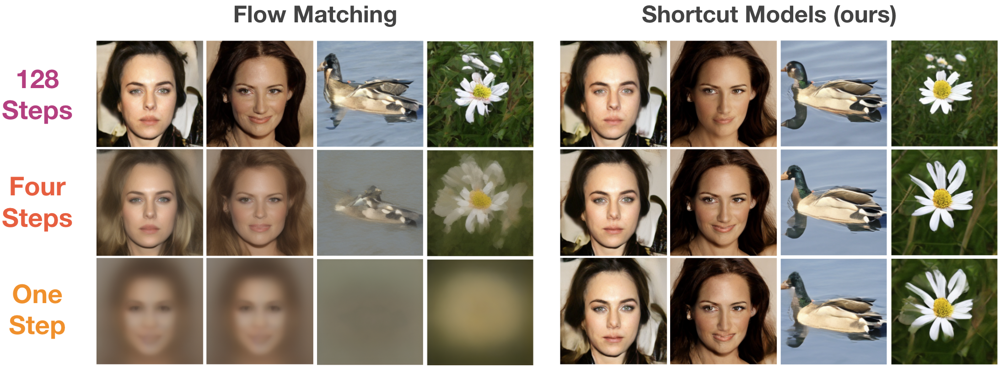
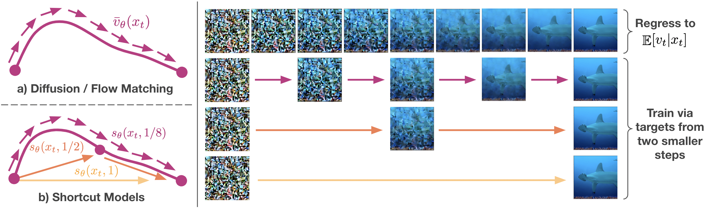

## One-Step Diffusion via Shortcut Models 

Kevin Frans, Danijar Hafner, Sergey Levine, Pieter Abbeel

### Abstract
Diffusion models and flow-matching models have enabled generating diverse and realistic images by learning to transfer noise to data.
However, sampling from these models involves iterative denoising over many neural network passes, making generation slow and expensive.
Previous approaches for speeding up sampling require complex training regimes, such as multiple training phases, multiple networks, or fragile scheduling.
We introduce shortcut models, a family of generative models that use a single network and training phase to produce high-quality samples in a single or multiple sampling steps.
Shortcut models condition the network not only on the current noise level but also on the desired step size, allowing the model to skip ahead in the generation process.
Across a wide range of sampling step budgets, shortcut models consistently produce higher quality samples than previous approaches, such as consistency models and reflow.
Compared to distillation, shortcut models reduce complexity to a single network and training phase and additionally allow varying step budgets at inference time.



### Overview

Shortcut models can utilize standard diffusion architectures (e.g. DiT), and condition on both `t` and `d`. At `d ≈ 0`, the shortcut objective is equivalent to the flow-matching objective, and can be trained by regressing onto empirical `E[vt|xt]` samples. Targets for larger `d` shortcuts are constructed by concatenating a sequence of two `d/2` shortcuts. Both objectives can be trained jointly; shortcut models do not require a two-stage procedure or discretization schedule.



### Using the code

This codebase is written in JAX, and was developed on TPU-v3 machines. You should start by installing the conda dependencies from `environment.yml` and `requirements.txt`. To load datasets, we use TFDS, and you can see our specific dataloaders at [https://github.com/kvfrans/tfds_builders](https://github.com/kvfrans/tfds_builders), of course you are free to use your own dataloader as well. 

To train a DiT-B scale model on CelebA:
```
python train.py --model.hidden_size 768 --model.patch_size 2 --model.depth 12 --model.num_heads 12 --model.mlp_ratio 4 --dataset_name celebahq256 --fid_stats data/celeba256_fidstats_ours.npz --model.cfg_scale 0 --model.class_dropout_prob 1 --model.num_classes 1 --batch_size 64 --max_steps 410_000 --model.train_type shortcut
```
or on Imagenet-256:
``` 
python train.py --model.hidden_size 768 --model.patch_size 2 --model.depth 12 --model.num_heads 12 --model.mlp_ratio 4 --dataset_name imagenet256 --fid_stats data/imagenet256_fidstats_ours.npz --model.cfg_scale 1.5 --model.class_dropout_prob 0.1 --model.bootstrap_cfg 1 --batch_size 256 --max_steps 810_000 --model.train_type shortcut
```

A larger DiT-XL scale model can be trained via:
``` 
python train.py --model.hidden_size 1152 --model.patch_size 2 --model.depth 28 --model.num_heads 16 --model.mlp_ratio 4 --dataset_name imagenet256 --fid_stats data/imagenet256_fidstats_ours.npz --model.cfg_scale 1.5 --model.class_dropout_prob 0.1 --model.bootstrap_cfg 1 --batch_size 256 --max_steps 810_000 --model.train_type shortcut
```

To train a regular flow model instead, use `--model.train_type naive`. This code also supports `--model.sharding fsdp` for fully-sharded data parallelism, which is recommended if you are training on a multi-GPU or TPU machine.

### Sanity Checking

Shorcut models trained with the provided functions should achieve the following performance.

|                           | 128-Step| 4-Step  | 1-Step  |
| --------                  | ------- | ------- | ------- |
| CelebA (DiT-B)            | 6.9     | 13.8    | 20.5    |
| Imagenet-256 (DiT-B)      | 15.5    | 28.3    | 40.3    |
| Imagenet-256 (DiT-XL)     | 3.8     | 7.8     | 10.6    |

### Checkpoints and FID Stats

Pretrained model checkpoints, and pre-computed reference FID stats for CelebA and Imagenet can be downloaded from [this drive](https://drive.google.com/drive/folders/1g665i0vMxm8qqqcp5mAiexnL919-gMwW?usp=sharing). To load a checkpoint, use the `--load_dir` flag. 