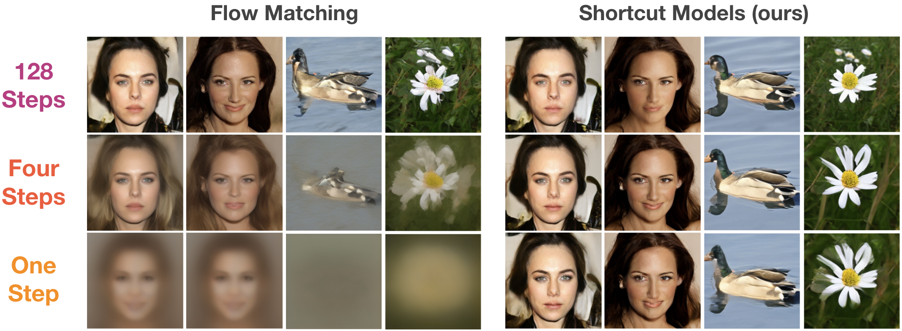
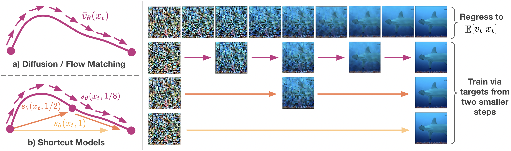

## One-Step Diffusion via Shortcut Models 

Kevin Frans, Danijar Hafner, Sergey Levine, Pieter Abbeel

[Paper Link](https://arxiv.org/abs/2410.12557)
[Website Link](https://kvfrans.com/shortcut-models/)

### Abstract
Diffusion models and flow-matching models have enabled generating diverse and realistic images by learning to transfer noise to data.
However, sampling from these models involves iterative denoising over many neural network passes, making generation slow and expensive.
Previous approaches for speeding up sampling require complex training regimes, such as multiple training phases, multiple networks, or fragile scheduling.
We introduce shortcut models, a family of generative models that use a single network and training phase to produce high-quality samples in a single or multiple sampling steps.
Shortcut models condition the network not only on the current noise level but also on the desired step size, allowing the model to skip ahead in the generation process.
Across a wide range of sampling step budgets, shortcut models consistently produce higher quality samples than previous approaches, such as consistency models and reflow.
Compared to distillation, shortcut models reduce complexity to a single network and training phase and additionally allow varying step budgets at inference time.



### Overview

Shortcut models can utilize standard diffusion architectures (e.g. DiT), and condition on both `t` and `d`. At `d ≈ 0`, the shortcut objective is equivalent to the flow-matching objective, and can be trained by regressing onto empirical `E[vt|xt]` samples. Targets for larger `d` shortcuts are constructed by concatenating a sequence of two `d/2` shortcuts. Both objectives can be trained jointly; shortcut models do not require a two-stage procedure or discretization schedule.



### Using the code

This codebase is written in JAX, and was developed on TPU-v3 machines. You should start by installing the conda dependencies from `environment.yml` and `requirements.txt`. To load datasets, we use TFDS, and you can see our specific dataloaders at [https://github.com/kvfrans/tfds_builders](https://github.com/kvfrans/tfds_builders), of course you are free to use your own dataloader as well. 

To train a DiT-B scale model on CelebA:
```
python train.py --model.hidden_size 768 --model.patch_size 2 --model.depth 12 --model.num_heads 12 --model.mlp_ratio 4 --dataset_name celebahq256 --fid_stats data/celeba256_fidstats_ours.npz --model.cfg_scale 0 --model.class_dropout_prob 1 --model.num_classes 1 --batch_size 64 --max_steps 410_000 --model.train_type shortcut
```
or on Imagenet-256:
``` 
python train.py --model.hidden_size 768 --model.patch_size 2 --model.depth 12 --model.num_heads 12 --model.mlp_ratio 4 --dataset_name imagenet256 --fid_stats data/imagenet256_fidstats_ours.npz --model.cfg_scale 1.5 --model.class_dropout_prob 0.1 --model.bootstrap_cfg 1 --batch_size 256 --max_steps 810_000 --model.train_type shortcut
```

A larger DiT-XL scale model can be trained via:
``` 
python train.py --model.hidden_size 1152 --model.patch_size 2 --model.depth 28 --model.num_heads 16 --model.mlp_ratio 4 --dataset_name imagenet256 --fid_stats data/imagenet256_fidstats_ours.npz --model.cfg_scale 1.5 --model.class_dropout_prob 0.1 --model.bootstrap_cfg 1 --batch_size 256 --max_steps 810_000 --model.train_type shortcut
```

This code also supports `--model.sharding fsdp` for fully-sharded data parallelism, which is recommended if you are training on a multi-GPU or TPU machine.

### GMM-Based Naive Flow Matching

On the `gmm` branch, `--model.train_type naive` is a GMM-conditioned flow-matching path. It first fits a diagonal GMM on StableVAE latents, then for every training latent `x_1` infers the hard component `k = argmax q(k|x_1)`, samples `x_0 ~ N(mu_k, sigma_k)`, and conditions the DiT on the selected component `mu_k/sigma_k`.

Fit the GMM:

```bash
python data_prep.py \
  --dataset_name celebahq256 \
  --tfds_data_dir /kaggle/working/tfds \
  --batch_size 64 \
  --gmm_save_path /kaggle/working/celebahq256_gmm_stats.npz \
  --gmm_num_modes 64 \
  --gmm_em_iters 25 \
  --gmm_em_restarts 1 \
  --gmm_pi_prior_type dirichlet \
  --gmm_pi_prior_strength 1e-2 \
  --gmm_var_prior_type none \
  --gmm_var_prior_strength 0 \
  --gmm_var_prior_target_var 1.0 \
  --gmm_min_std 0.0 \
  --gmm_min_std_data_frac 1.0 \
  --gmm_standardize_data 0 \
  --metrics_output_path /kaggle/working/gmm_diagnostics/gmm_metrics.json \
  --gmm_em_metrics_output_path /kaggle/working/gmm_diagnostics/gmm_em_metrics.jsonl
```

`--gmm_pi_prior_type` controls how component weights are pulled toward uniform during EM:
`dirichlet` uses the original symmetric pseudo-count update, `kl` optimizes the pi M-step with a `D_KL(pi || uniform)` penalty, and `none` uses the maximum-likelihood count update. Increase `--gmm_pi_prior_strength` to make either regularizer stronger. For KL mode, the strength is on the same count scale as the EM soft counts; for example, with 32768 fit samples and 64 modes, `512` is roughly one ideal component count.

By default `--gmm_standardize_data 0`, so the GMM is fit and queried directly in the original StableVAE latent space. This avoids per-dimension rescaling of the latent coordinates. If `--gmm_standardize_data 1` is set, the GMM fit uses `(x - mean) / std` internally and stores the inverse transform in the `.npz`.

The default final fit data is still the data latent set `x1`. For ablations, `--gmm_fit_data_mode mix` first fits an initial GMM on `x1`, samples prior-side latents from that initial GMM, builds a mixed fit set with `--gmm_mix_x1_prob`, then fits the final GMM on that mixed set. `--gmm_continue_em_iters N` runs an extra warm-start EM phase from the initial `x1` GMM: with `gmm_fit_data_mode x1` it continues EM on `x1`, and with `mix` it continues EM on the mixed set. This is a pre-FM GMM refinement; the saved GMM and router are still frozen during `train.py --model.train_type gmm-tide`.

`--gmm_min_std` and `--gmm_min_std_data_frac` are hard variance floors: after the variance M-step, every diagonal component variance is clamped to at least the effective floor in the active GMM fit space. With the default unscaled fit, `gmm_min_std_data_frac` means a fraction of each latent dimension's original data std. `--gmm_var_prior_type kl` adds a softer variance regularizer before that clamp. It pulls each component variance toward `--gmm_var_prior_target_var` in the active GMM fit space with strength `--gmm_var_prior_strength`; use this to tune coverage pressure without relying only on the hard floor. `none` leaves the variance M-step at maximum likelihood plus the hard floor.
`--gmm_init_strategy` controls component mean seeding before EM. `auto` preserves the old behavior (`kmeans++` when `--gmm_kmeanspp_init=1`, otherwise random). Extra options are `farthest`, `pca`, and `split`; `--gmm_init_warmup_iters` runs Lloyd/k-means refinement before the first EM M-step. For the toy-supported CelebA check, `farthest` with `--gmm_init_warmup_iters 5` is the "farthest + Lloyd" variant.
`gmm_metrics.json` contains the final diagnostics plus the full EM trace after fitting completes, while `gmm_em_metrics.jsonl` is streamed once per EM iteration during fitting. Both outputs also get CSV companions (`gmm_metrics.csv`, `gmm_em_metrics.csv`) with long-form rows `phase,step,metric,value`; the final CSV uses the same `gmm/...` numeric metric names that are sent to W&B.

Train GMM-conditioned FM:

```bash
python train.py \
  --dataset_name celebahq256 \
  --tfds_data_dir /kaggle/working/tfds \
  --fid_stats data/celeba256_fidstats_ours.npz \
  --model.train_type naive \
  --model.gmm_stats_path /kaggle/working/celebahq256_gmm_stats.npz \
  --model.gmm_cond_channels 64 \
  --eval_fid_timesteps 1,4,32,128 \
  --metrics_output_path /kaggle/working/gmm_diagnostics/train_metrics.jsonl
```

The old Gaussian flow-matching baseline remains available as `--model.train_type naive-gaussian`.

### GMM-TIDE Router Flow Matching

`--model.train_type gmm-tide` is the GMM router variant. It keeps the diagonal GMM fixed, distills the GMM posterior `q_GMM(k|x)` into a CNN router `f_phi`, then uses that router during FM training. During FM, the router reads a GMM-prior base sample, selects top-k components, samples one latent from each selected component, and forms a weighted source latent `x0_tide`. The DiT is trained from `x0_tide` to the data latent and is conditioned on the weighted `mu/sigma` aggregate.

Distill the router after fitting the GMM:

```bash
python train_gmm_router.py \
  --dataset_name celebahq256 \
  --tfds_data_dir /kaggle/working/tfds \
  --batch_size 64 \
  --gmm_stats_path /kaggle/working/celebahq256_gmm_stats.npz \
  --router_save_path /kaggle/working/celebahq256_gmm_router.pkl \
  --router_train_data_mode mix \
  --router_mix_x1_prob 0.5 \
  --router_target_type soft_kl \
  --router_max_steps 10000 \
  --router_weight_decay 3e-4 \
  --router_save_best=True \
  --metrics_output_path /kaggle/working/gmm_diagnostics/router_metrics.jsonl
```

`--router_train_data_mode x1` trains the router only on data latents. `mix` blends data latents and GMM-prior samples according to `--router_mix_x1_prob`; this is the default for V1 because the FM source path queries the router on prior-side latents. `--router_target_type soft_kl` matches the full posterior distribution, while `hard_ce` trains only against `argmax q_GMM(k|x)`. Router checkpoints default to `--router_save_best=True`, selecting the lowest validation-loss checkpoint instead of blindly saving the last step. Validation logs include overfit diagnostics such as `router_overfit/loss_gap`, `router_overfit/loss_valid_to_train_ratio`, `router_overfit/kl_to_gmm_gap`, `router_overfit/top1_agreement_gap`, and `router_overfit/steps_since_best_valid`.

Train FM with the default frozen router:

```bash
python train.py \
  --dataset_name celebahq256 \
  --tfds_data_dir /kaggle/working/tfds \
  --fid_stats data/celeba256_fidstats_ours.npz \
  --model.train_type gmm-tide \
  --model.gmm_stats_path /kaggle/working/celebahq256_gmm_stats.npz \
  --model.gmm_router_path /kaggle/working/celebahq256_gmm_router.pkl \
  --model.gmm_router_topk 4 \
  --model.gmm_router_temperature 1.0 \
  --model.gmm_router_update_policy frozen \
  --model.gmm_cond_channels 64 \
  --eval_fid_timesteps 1,4,32,128 \
  --metrics_output_path /kaggle/working/gmm_diagnostics/train_metrics.jsonl
```

`--model.gmm_router_update_policy frozen` preserves the original staged behavior: GMM and router are fixed during FM, and only the DiT parameters are updated. To continue training the distill network with FM, use `joint`:

```bash
python train.py \
  --dataset_name celebahq256 \
  --tfds_data_dir /kaggle/working/tfds \
  --fid_stats data/celeba256_fidstats_ours.npz \
  --model.train_type gmm-tide \
  --model.gmm_stats_path /kaggle/working/celebahq256_gmm_stats.npz \
  --model.gmm_router_path /kaggle/working/celebahq256_gmm_router.pkl \
  --model.gmm_router_topk 2 \
  --model.gmm_router_temperature 1.0 \
  --model.gmm_router_gradient_mode topk \
  --model.gmm_router_gumbel_tau 1.0 \
  --model.gmm_router_update_policy joint \
  --model.gmm_router_lr 3e-5 \
  --model.gmm_router_distill_weight 1.0 \
  --model.gmm_router_usage_weight 0.01 \
  --model.gmm_router_entropy_weight 0.0 \
  --model.gmm_cond_channels 64 \
  --eval_fid_timesteps 1,4,32,128 \
  --metrics_output_path /kaggle/working/gmm_diagnostics/train_metrics.jsonl
```

In `joint` mode, `f_phi` has its own AdamW optimizer state. With the default `--model.gmm_router_gradient_mode topk`, the FM loss is differentiated through the selected top-k weights only; the discrete component ids returned by `top_k` do not receive a useful gradient. For routing ablations, `straight_through_full` keeps the forward source as top-k MoE but uses a full-soft straight-through backward pass, and `gumbel_st` adds Gumbel-softmax relaxation before the same straight-through top-k forward pass. `--model.gmm_router_gumbel_tau` controls the Gumbel relaxation temperature, with `0.5` and `1.0` used as the first small sweep. Eval and inference use the same routing mode and tau so FID reflects the trained source policy. In all modes the GMM component parameters remain fixed. The total optimized loss is:

```text
L_total = L_FM
        + gmm_router_distill_weight * KL(q_GMM(k|x0_base) || q_phi(k|x0_base))
        + gmm_router_usage_weight * KL(mean_batch q_phi(k|x0_base) || Uniform)
        - gmm_router_entropy_weight * H(q_phi)
```

`gmm_router_distill_weight` keeps the router anchored to the fitted GMM posterior. `gmm_router_usage_weight` discourages collapse into a small number of selected components. `gmm_router_entropy_weight` can be used to soften router probabilities, but should usually start at `0.0`. Joint checkpoints include both `train_state` and `router_state`, so resuming from a joint run continues the router parameters as well as the DiT parameters.

The focused router-relaxation grid [configs/gmm_tide_fm_router_relax6_grid.json](configs/gmm_tide_fm_router_relax6_grid.json) does not resubmit the old top-k baselines. It records the previous baseline run names in each job and only submits six new runs: two source settings crossed with `straight_through_full`, `gumbel_st` at `tau=0.5`, and `gumbel_st` at `tau=1.0`.
The farthest-Lloyd CelebA check [configs/gmm_tide_fm_farthest_lloyd2_grid.json](configs/gmm_tide_fm_farthest_lloyd2_grid.json) tests two GMM-TIDE sources with `gmm_init_strategy=farthest` and `gmm_init_warmup_iters=5`: one K16 soft-variance/Dirichlet source and one K32 hard-floor source. It is intended to validate whether the toy `farthest_lw5` signal transfers to CelebA before expanding the mesh.

Render and submit the default Kaggle V1 runs from [configs/gmm_tide_fm_grid.json](configs/gmm_tide_fm_grid.json):

```bash
python scripts/submit_gmm_tide_fm_jobs.py \
  --owners all \
  --exclude-owners kieutung,no1ceboy \
  --accelerator tpu \
  --report-path reports/gmm_tide_fm_submit.json
```

The default mesh focuses on overfit-aware router distillation and penalty settings selected from the GMM-only ablation: `K=16` and `K=32`, mostly `topk=2`, one `topk=4` anchor per main K, hard floor `0.5` candidates, and mild soft variance pressure around target variance `0.75`. The router uses more validation batches, logs train/valid gaps, and saves the best validation checkpoint. Each notebook downloads the CelebA-HQ payload with the Kaggle CLI, reuses the prebuilt TFDS payload when `celebahq256/*/dataset_info.json` is present, then runs GMM fitting, router distillation, then `train.py --model.train_type gmm-tide`, and writes GMM/router/train diagnostics under `/kaggle/working/gmm_tide_fm/<run>/diagnostics`.
The submit helper reads `WANDB_API_KEY` from `--env-file` (default `.secrets/.env`) and injects it into the private staged notebook before `kaggle kernels push`; if no key is available, the notebook falls back to Kaggle secrets and then offline W&B mode. Embedded configs are loaded through `json.loads`, so JSON booleans/nulls from the grid remain valid in the generated Python notebook. Dataset-provided `data/` files are merged into the cloned repo instead of replacing the repo `data/` directory, matching the GMM ablation notebooks. Because the notebook checks out a fixed `repo_commit`, the submit helper refuses to push when tracked files are dirty or the commit is not visible from a remote-tracking branch; commit and push first, or pass `--allow-dirty` only for deliberate debugging.
GMM-TIDE submit grids can also override the FM optimizer recipe with `model_lr`, `model_warmup`, `model_use_cosine`, `model_beta1`, `model_beta2`, and `model_weight_decay`. These fields are passed through to `train.py` as `--model.lr`, `--model.warmup`, `--model.use_cosine`, `--model.beta1`, `--model.beta2`, and `--model.weight_decay`. This keeps source/top-k ablations reproducible while allowing focused FM retuning such as slower warmup starts for GMM/TIDE sources.
They can also override flow-time sampling with `model_t_sampling`. The default `discrete-dt` keeps the original discrete uniform sampler over `denoise_timesteps`. `beta` samples continuous `t ~ Beta(model_t_beta_alpha, model_t_beta_beta)`, while `beta-discrete` samples from the same beta distribution and snaps back onto the denoise timestep grid. The focused beta grid [configs/gmm_tide_fm_beta_tsampling4_grid.json](configs/gmm_tide_fm_beta_tsampling4_grid.json) keeps the K16/top2 soft075-dir512 joint-mix source fixed and tests `(alpha,beta) = (1,3), (3,1), (2,2), (0.5,0.5)`.
Evaluation rollout can also use a non-uniform Euler grid through `model_eval_ode_schedule` and `model_eval_ode_power`. The default `uniform` keeps the previous solver. `end_dense` uses time edges `t_i = (i / N) ** model_eval_ode_power`, so powers below `1` place smaller integration steps near `t=1` while leaving the model `dt` conditioning compatible with the existing training setup. The focused B check [configs/gmm_tide_fm_beta35_enddense_grid.json](configs/gmm_tide_fm_beta35_enddense_grid.json) keeps the current Beta(3.5, 1.3) training source and tests `end_dense` with power `0.7`.
Before submitting, `submit_gmm_tide_fm_jobs.py` also builds the shared Kaggle running-context report from `reports/*.json` by default. Active kernels from GMM-only queues or other TIDE submit reports count toward `--max-submit-per-owner` so one branch does not submit into an account already occupied by another branch. Use `--shared-context-glob` to control which reports are scanned, `--no-live-shared-context` to skip live Kaggle status checks, or `--no-shared-context` for deliberate manual overrides. Jobs that cannot find an owner under the active-count limit are written to `not_submitted` in the report instead of repeatedly hitting Kaggle TPU quota errors.
The follow-up ablation mesh [configs/gmm_tide_fm_next10_grid.json](configs/gmm_tide_fm_next10_grid.json) narrows around the best timeout-truncated run: K16/K32 soft variance pressure, target variance near `0.75`, router temperature/top-k checks, and `train_max_steps=350000` so Kaggle TPU notebooks can finish cleanly before the usual timeout.
The mix/continue mesh [configs/gmm_tide_fm_mix_continue12_grid.json](configs/gmm_tide_fm_mix_continue12_grid.json) takes the top four finished GMM-TIDE runs and tests three GMM preparation variants for each: mixed GMM fit without continuation, mixed fit with 10 warm-start EM iterations, and x1-only fit with 10 warm-start EM iterations. In that mesh, "continue" refers only to extra EM iterations before FM; it does not mean joint router-FM training. Use `--model.gmm_router_update_policy joint` for FM-time updates to the distill network. The four original runs remain the baseline for the no-mix/no-continue setting.

To resume a Kaggle TIDE run, add `resume_kernel_ref` to a submit-grid job, for example `owner/kernel-slug`. The rendered private notebook downloads the previous notebook outputs through `kaggle kernels output`, but filters that download to `gmm_stats.npz`, `gmm_router.pkl`, lightweight diagnostics, and the requested checkpoint step. It then copies the selected old checkpoint into the new run directory, deletes old downloaded checkpoint trees by default, and calls `train.py --load_dir <copied-checkpoint> --reset_step_on_load 0 --delete_load_dir_after_load 1`. The same notebook still downloads the CelebA-HQ dataset and merges dataset `data/` into the repo before training; after `uv sync` it also clears uv/pip caches to reduce Kaggle disk pressure. Optional resume fields are `resume_run_name`, `resume_checkpoint_step`, `resume_download_output`, `resume_copy_full_output`, `resume_copy_to`, `resume_overwrite_code`, `resume_reuse_gmm_router`, `resume_cleanup_download_dir`, `delete_load_dir_after_load`, and `reset_step_on_load`. By default `resume_copy_full_output` and `resume_overwrite_code` are false, so a previous `shortcut-models/` output or `.venv` tree is not copied over the freshly checked-out commit; set them true only when intentionally running the code bundled with the old output. New checkpoints are written to one stable file under `/kaggle/working/ckpts/<run>.pkl` instead of accumulating step-suffixed copies; `--save_interval` now defaults to `150000`. Generated notebooks set `WANDB__SERVICE_WAIT=120` to tolerate slow W&B startup on Kaggle TPU workers. When `resume_download_output` is true, the staged notebook injects the Kaggle credential for the owner in `resume_kernel_ref`, falling back to the target submit owner only when that source owner is unavailable locally. The notebook also exports `KAGGLE_USERNAME` and `KAGGLE_KEY` from that injected source credential while downloading resume output so Kaggle runtime credentials from the target account cannot override `KAGGLE_CONFIG_DIR`. For private source kernels where Kaggle runtime still denies cross-account output download, set `resume_download_output=false` and run under the source owner; the submit helper then attaches the previous kernel output as a Kaggle kernel source and the notebook locates `gmm_stats.npz`, `gmm_router.pkl`, and `.pkl` checkpoints from `/kaggle/input`. Attaching the previous kernel as a Kaggle kernel source is not required for the CLI-download path; the temporary Kaggle credential directory and credential environment variables are removed after the output download. Generated notebooks also print the tail of redirected stdout/stderr files when `uv sync`, GMM prep, router distillation, or FM training fails, so Kaggle logs contain the real failing stack trace even when output files are not published after an errored notebook.

Metrics are logged to W&B, JSONL, and long-form CSV. For example, `router_metrics.jsonl` also creates `router_metrics.csv`, and `train_metrics.jsonl` also creates `train_metrics.csv` with columns `phase,step,metric,value`. Router distillation logs train/valid KL or CE loss, target entropy, top-1 agreement, top-1 confidence, cluster usage entropy, unique predicted clusters, gradient/update/parameter norms, activation norms, and overfit gaps. FM training logs the TIDE metrics from `targets_gmm_tide.py`, `x0/x1/v_target` magnitude, variance, and second-moment diagnostics, plus an empirical MSE decomposition: `training/fm/loss_residual_variance`, `training/fm/loss_residual_mean_sq`, `training/fm/loss_residual_decomp_sum`, per-sample loss variance/std, and target/prediction variance and second moment. In `joint` mode it also logs `training/router/loss_distill`, `training/router/loss_usage_uniform`, `training/router/grad_norm_joint`, `training/router/update_norm_joint`, hard top-1 collapse metrics such as `training/router/usage_kl_to_uniform`, and differentiable soft-usage metrics such as `training/router/soft_usage_kl_to_uniform` and `training/router/soft_usage_entropy_normalized`.

After downloading Kaggle outputs, summarize FID, FM variance, and router overfit diagnostics with:

```bash
python scripts/collect_gmm_tide_results.py \
  --input-root outputs/kaggle \
  --output-json reports/gmm_tide_results.json
```

### Toy GMM/FM Ablations

The `moe2` branch also includes the self-contained toy notebooks ported from the `gmm` branch. They are meant for quick CPU/GPU checks before launching expensive CelebA-HQ latent jobs:

- [toy-gmm-fm-insight.ipynb](toy-gmm-fm-insight.ipynb) compares Gaussian and GMM source construction on small 2D datasets.
- [toy-gmm-big-ablation.ipynb](toy-gmm-big-ablation.ipynb) runs larger toy GMM diagnostics and source-quality proxies across several nonlinear or anisotropic toy distributions.
- [toy-fm-gpu-ablation.ipynb](toy-fm-gpu-ablation.ipynb) trains small JAX MLP flow-matching models on toy data to compare Gaussian sources against GMM sources from different initialization strategies.

For the closest toy analogue to the `moe2` pipeline, run GMM fit, router distillation, TIDE source construction, and FM training end-to-end:

```bash
./.venv/bin/python scripts/run_toy_moe2_fm_ablation.py \
  --datasets aniso_blobs,nested_rings,pinwheel \
  --gmm-modes 16 \
  --topk 2 \
  --router-steps 400 \
  --fm-steps 800 \
  --out-dir toy_moe2_outputs
```

The same runner can also stress-test higher-dimensional image manifolds by loading Keras datasets, projecting them with PCA, then running the full GMM/router/FM pipeline. The grid in [configs/toy_moe2_fm_complex_init_grid.json](configs/toy_moe2_fm_complex_init_grid.json) covers harder 2D toys (`checkerboard`, `spiral_blobs`) and PCA versions of `mnist`, `fashion_mnist`, and `cifar10`. It compares k-means++, k-means++ with Lloyd warmup, farthest-point with Lloyd warmup, PCA seeding, split seeding, hybrid k-means++/farthest seeding, and quantile-PCA seeding.

Submit the configured toy/image full-FM notebooks to Kaggle GPU accounts with:

```bash
./.venv/bin/python scripts/submit_toy_moe2_fm_jobs.py \
  --grid-config configs/toy_moe2_fm_complex_init_grid.json \
  --owners all \
  --exclude-owners kieutung \
  --accelerator gpu \
  --report-path reports/toy_moe2_fm_complex_init_submit.json
```

For source-mechanism ablations, use [configs/toy_moe2_fm_source_grid.json](configs/toy_moe2_fm_source_grid.json). This grid keeps the same full pipeline but changes the part after GMM fitting: direct GMM source, distilled router source, oracle `q_GMM(k|x)`, nearest-component source, uniform mixture, top-k/temperature, and simple FM retunes with `uniform`, `beta(1,3)`, `beta(3,1)`, or `beta(2,2)` time sampling.

```bash
./.venv/bin/python scripts/submit_toy_moe2_fm_jobs.py \
  --grid-config configs/toy_moe2_fm_source_grid.json \
  --owners all \
  --exclude-owners kieutung \
  --accelerator gpu \
  --report-path reports/toy_moe2_fm_source_submit.json
```

Regenerate the notebooks from source with:

```bash
python scripts/create_toy_gmm_fm_notebook.py
python scripts/create_toy_gmm_big_ablation_notebook.py
python scripts/create_toy_fm_gpu_ablation_notebook.py
```

Each notebook writes a compact executed-report notebook, CSV/JSON summaries, and plots into ignored local output folders (`toy_outputs/`, `toy_big_outputs/`, `toy_fm_outputs/`, or `/kaggle/working/toy_moe2_fm/<run>` for submitted full-pipeline jobs). See [ablations_toy_vi.md](ablations_toy_vi.md) for the intended interpretation and how these toy checks map back to GMM-TIDE source choices on `moe2`.

### GMM Ablations on Kaggle

The ablation template [shortcut-model-gmm-ablation.ipynb](shortcut-model-gmm-ablation.ipynb) runs one GMM-only diagnostics job from an embedded config. It fits the GMM and writes diagnostics; it does not train the FM model. It downloads the dataset inside the notebook with:

```bash
kaggle datasets download -d codemaivanngu/shortcut-celebahq256 --unzip
```

The grid in [configs/gmm_ablation_grid.json](configs/gmm_ablation_grid.json) sweeps:

- `gmm_num_modes`
- `gmm_min_var`
- `gmm_min_var_data_frac`
- `gmm_pi_prior_type`
- `gmm_pi_prior_strength`
- `gmm_var_prior_type`
- `gmm_var_prior_strength`
- `gmm_var_prior_target_var`
- `gmm_standardize_data`

When the grid contains a `coverage` list, each entry explicitly selects one coverage regime. This avoids accidentally testing only the Cartesian product of every floor with every soft prior. The current mesh includes `ml-no-coverage`, `hard*`, and `soft-*` regimes only, so hard-only and soft-only coverage pressure can be compared directly without combined hard+soft runs.
The grid names hard floors in variance units (`gmm_min_var`, `gmm_min_var_data_frac`). The staging script converts those values to the current runtime `data_prep.py` std-floor flags when rendering notebooks.

Stage notebooks without pushing:

```bash
python scripts/stage_gmm_ablation_jobs.py \
  --owner codemaivanngu \
  --batch-size 8 \
  --manifest-path reports/gmm_ablation_stage_manifest.json \
  --limit 2
```

This render step is deterministic from [configs/gmm_ablation_grid.json](configs/gmm_ablation_grid.json): changing the mesh and rerunning the command creates a new set of staged notebooks plus a JSON/Markdown manifest that records which grid indexes and run names were packed into each notebook.

Push GPU or TPU jobs directly to Kaggle:

```bash
python scripts/push_gmm_ablation_jobs.py \
  --owners codemaivanngu \
  --accelerator NvidiaTeslaT4 \
  --report-path reports/gmm_ablation_submit.json \
  --limit 2
```

Use `--owners all` to distribute jobs round-robin across accounts listed in `.secrets/all-kaggle.json`; use `--exclude-owners` to skip accounts that should not receive a job, and set `--accelerator TpuV5E8` for Kaggle TPU sessions. The push helper writes JSON and Markdown submit reports to `--report-path`, and it records submitted, failed, and not-submitted rows as the batch progresses. Staged notebooks are written under `kaggle_staging/`, which is ignored by git; the source notebook only contains a W&B placeholder, while the staging script injects `WANDB_API_KEY` from `.secrets/.env` into the pushed private notebook.

When notebook dataset payloads include a `data/` directory, the notebooks merge those files into the cloned repo `data/` directory instead of replacing it. This keeps repo-local auxiliary files such as `data/imagenet_labels.txt` available for train/eval while still allowing dataset-provided FID stats or cached assets to override/add files.

Kaggle Python 3.12 images can combine older TFDS metadata protos with a newer protobuf runtime. The notebooks pin `protobuf<4` for TFDS tooling and run `tfds build` with `PROTOCOL_BUFFERS_PYTHON_IMPLEMENTATION=python`; this is intentionally scoped to notebook dataset preparation and does not change the repo TPU/JAX environment in `pyproject.toml`.

After jobs have been submitted, collect completed diagnostics without downloading the full Kaggle output:

```bash
python scripts/collect_gmm_ablation_results.py \
  --submit-report reports/gmm_ablation_tpu_reconciled_20260507.json \
  --output-root outputs/kaggle/gmm_ablation_results \
  --report-path reports/gmm_ablation_results.json
```

The collector checks each kernel status, downloads only `gmm_metrics.json`, `gmm_em_metrics.jsonl`, `gmm_prep_stdout.txt`, and `gmm_prep_stderr.txt` for completed jobs, then writes aggregate JSON and Markdown reports with NLL, cluster balance, dead-component, variance-floor, and overlap metrics. For batch notebooks, status and downloads are cached by `kernel_id` so each Kaggle kernel is queried once even when it contains many config rows.

For longer ablation sweeps, use a persistent queue instead of manually tracking offsets:

```bash
python scripts/manage_gmm_ablation_queue.py \
  --queue-path reports/gmm_ablation_queue.json \
  --seed-report reports/gmm_ablation_results_20260507.json \
  --owners all \
  --exclude-owners kieutung \
  --accelerator TpuV5E8 \
  --sync-status \
  --push \
  --limit 12
```

The queue is rendered from the current grid every run. If new grid rows are added later, they appear as `pending`; existing `pending`, `running`, `complete`, and `failed` rows are carried forward by a stable config key. A successful Kaggle submit is marked `running` immediately, and Kaggle `QUEUED`/`RUNNING` statuses also remain `running` until a later `--sync-status` changes them to `complete` or `failed`.
Use `--reset` when the grid has been intentionally reshaped and old grid-index-only reports should not be carried into the new queue.

The queue manager also builds a shared Kaggle running-context report before pushing. By default it scans `reports/*.json`, queries live Kaggle kernel status, writes `reports/kaggle_shared_context.json` plus a Markdown companion, and counts active kernels from other reports/branches against each owner before selecting the next account. This prevents the GMM queue from blindly submitting to an account that is already busy with a `moe2` TIDE/FM job recorded in another report:

```bash
python scripts/kaggle_shared_context.py \
  --accounts-file /home/tung/all-kaggle.json \
  --report-glob 'reports/*.json' \
  --output reports/kaggle_shared_context.json
```

Use `--shared-context-glob` on `manage_gmm_ablation_queue.py` to add or narrow report sources, `--no-live-shared-context` for a fast local-only reconciliation, and `--no-shared-context` only when intentionally ignoring activity from other branch reports.

Because Kaggle TPU queue time can dominate the 5-6 minute GMM-only fit, the queue manager can pack multiple configs into one notebook with `--batch-size`. The batch notebook downloads/builds the dataset once, syncs the repo once, then runs `data_prep.py` sequentially for each embedded config and writes per-run diagnostics plus `/kaggle/working/gmm_ablation_batch/batch_summary.jsonl`:

```bash
python scripts/manage_gmm_ablation_queue.py \
  --queue-path reports/gmm_ablation_queue.json \
  --owners all \
  --exclude-owners kieutung,no1ceboy \
  --accelerator tpu \
  --sync-status \
  --push \
  --batch-size 8 \
  --limit 80
```

### Sanity Checking

Shorcut models trained with the provided functions should achieve the following FID-50k performance.

|                           | 128-Step| 4-Step  | 1-Step  |
| --------                  | ------- | ------- | ------- |
| CelebA (DiT-B)            | 6.9     | 13.8    | 20.5    |
| Imagenet-256 (DiT-B)      | 15.5    | 28.3    | 40.3    |
| Imagenet-256 (DiT-XL)     | 3.8     | 7.8     | 10.6    |

### Checkpoints and FID Stats

Pretrained model checkpoints, and pre-computed reference FID stats for CelebA and Imagenet can be downloaded from [this drive](https://drive.google.com/drive/folders/1g665i0vMxm8qqqcp5mAiexnL919-gMwW?usp=sharing). To load a checkpoint, use the `--load_dir` flag. 
