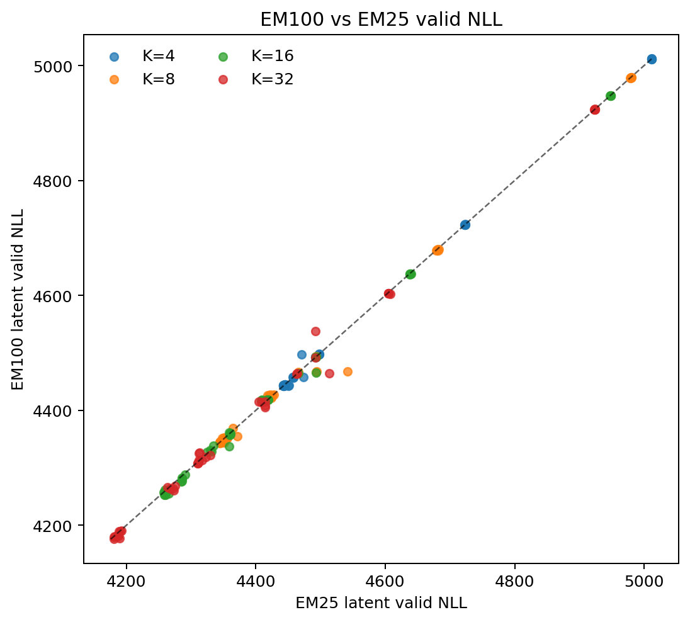
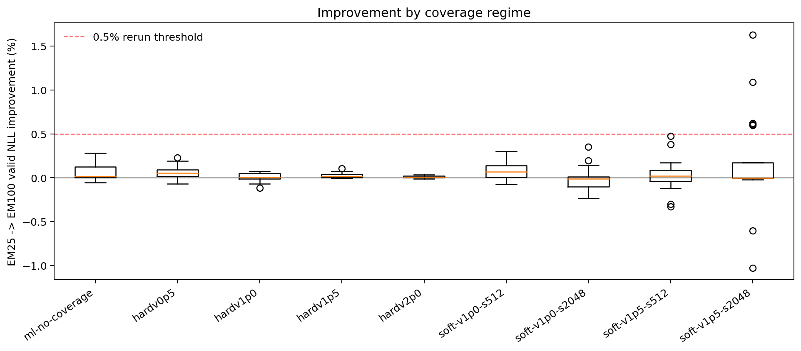
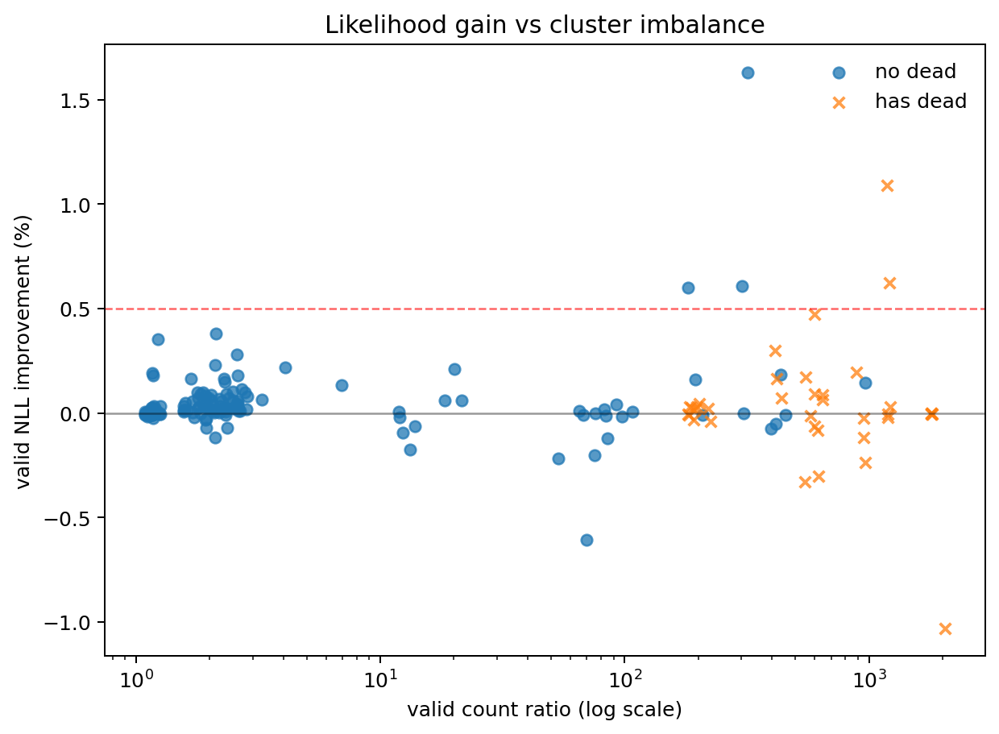
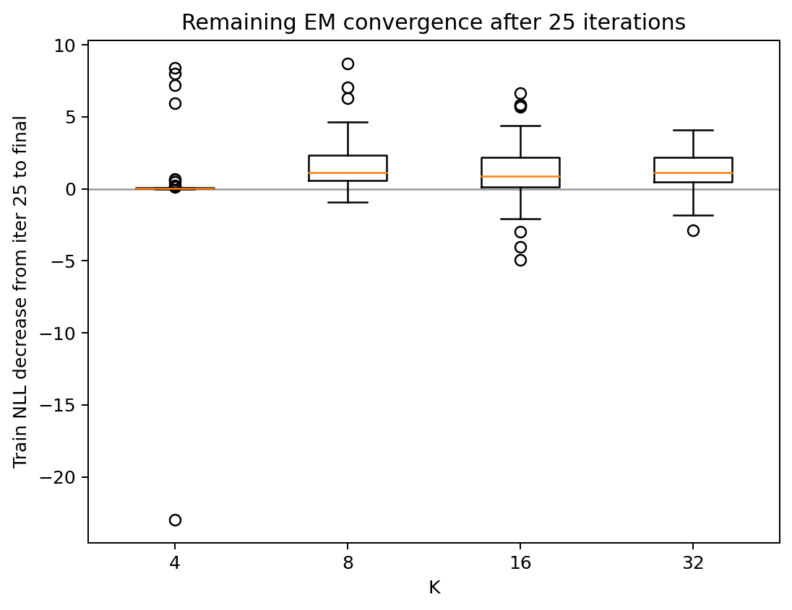
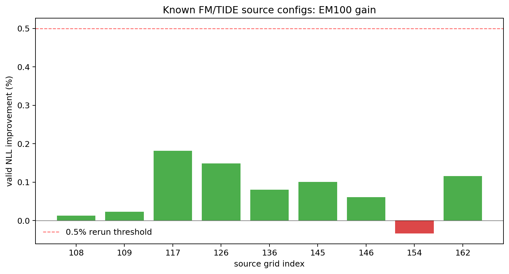

# Ablations

File này ghi lại kế hoạch ablation và danh mục thí nghiệm hiện tại cho các
nhánh GMM, GMM-FM và GMM-TIDE/FM. Mục tiêu là giúp tái lập được: đã thay knob
nào, vì sao mỗi batch tồn tại, và report local nằm ở đâu.

Cập nhật lần cuối: 2026-05-21.

## Thiết Lập Chung

- Dataset: `celebahq256` từ Kaggle dataset `codemaivanngu/shortcut-celebahq256`.
- Không gian dữ liệu chính: StableVAE latent space.
- Fit GMM mặc định:
  - `gmm_fit_samples=32768`
  - `gmm_valid_samples=4096`
  - `gmm_em_iters=25`
  - `gmm_em_restarts=1`
  - `gmm_em_chunk_size=128`
  - `gmm_kmeanspp_init=1`
- Hành vi raw/standardized mặc định:
  - Các run chính dùng `gmm_standardize_data=0`, tức GMM fit trực tiếp trong latent space.
  - Ablation chuẩn hóa dùng rõ `gmm_standardize_data=1`; nếu dùng cho FM thì sample phải unstandardize ngược về latent space trước khi đưa vào FM, trừ khi run cố ý test training trong standardized space.
- Eval FM mặc định:
  - `eval_fid_timesteps=1,4,32,128`
  - Các run TIDE/FM gần đây dùng `train_eval_interval=40000`.
- Diagnostic GMM:
  - train/valid NLL
  - KL/MSE/entropy của `pi` so với phân phối đều
  - min/max/gap/ratio số điểm mỗi cụm
  - dead component
  - variance toàn bộ data và variance từng component
  - khoảng cách tâm cụm và overlap proxy
  - tỉ lệ chạm variance floor.
- Diagnostic TIDE/FM:
  - FID tại timestep 1/4/32/128
  - metric độ thẳng flow
  - magnitude và variance của `x0/x1/v_target`
  - phân rã residual của FM loss
  - train/valid metric cho router distillation
  - metric usage/collapse của router
  - mirror metric ra JSONL và CSV.

## Toy GMM/FM Insight

Mục đích: chạy toy 2D thật rẻ để tách vấn đề GMM/source/FM trước khi tốn queue
TPU cho CelebA. Notebook tự chứa, không dùng TFDS/StableVAE/W&B, chạy trên
Kaggle CPU và tự ghi một notebook kết quả có plot nhúng.

Notebook/source:

- [toy-gmm-fm-insight.ipynb](toy-gmm-fm-insight.ipynb)
- [scripts/create_toy_gmm_fm_notebook.py](scripts/create_toy_gmm_fm_notebook.py)

Kaggle run:

- URL: <https://www.kaggle.com/code/kieutung/toy-gmm-fm-insight-kieutung-20260521-1115>
- Output notebook đã tải về: [outputs/kaggle/toy_gmm_fm_insight_20260521/toy_outputs/toy_gmm_fm_executed.ipynb](outputs/kaggle/toy_gmm_fm_insight_20260521/toy_outputs/toy_gmm_fm_executed.ipynb)
- Metrics: [outputs/kaggle/toy_gmm_fm_insight_20260521/toy_outputs/toy_metrics.csv](outputs/kaggle/toy_gmm_fm_insight_20260521/toy_outputs/toy_metrics.csv)

Plot:

- 
- 
- 
- 

### Toy Setup

Toy data gồm `blobs`, `rings`, `moons`. Mỗi dataset fit diagonal GMM với các
cấu hình nhỏ:

- `ml_k8`
- `hard05_k8`
- `soft1_s256_k8`
- `hard05_k16`

Sau đó so sánh các source cho FM proxy:

- `gaussian`: source Gaussian theo mean/std global của data.
- `gmm_hard_sample`: sample từ component argmax.
- `gmm_top2_mean`: mean top-2 có trọng số.
- `gmm_top2_weighted_sample`: sample top-2 rồi lấy weighted sum.

Metric chính:

- `source_to_target_dist`: độ dài trung bình `|x1 - x0|`.
- `target_vector_var_trace`: variance trace của target vector `v = x1 - x0`.
- `source_nn_dist`: khoảng cách trung bình từ source tới điểm data gần nhất,
  dùng như proxy off-manifold/blur.
- `linear_fm_mse`, `quadratic_fm_mse`: fit ridge field đơn giản từ `(x_t,t)`
  sang `v`, dùng làm proxy độ khó của target vector field.

### Toy Result Với Best GMM Mỗi Dataset

| Dataset | Source | `|x1-x0|` | Off-manifold | Quad FM MSE | Target var trace |
|---|---|---:|---:|---:|---:|
| blobs | gaussian | `3.592` | `0.760` | `6.2184` | `15.908` |
| blobs | gmm_hard_sample | `0.764` | `0.161` | `0.3710` | `0.762` |
| blobs | gmm_top2_mean | `0.524` | `0.097` | `0.1742` | `0.359` |
| blobs | gmm_top2_weighted_sample | `0.735` | `0.158` | `0.3414` | `0.701` |
| moons | gaussian | `2.760` | `0.732` | `3.5633` | `9.351` |
| moons | gmm_hard_sample | `0.651` | `0.150` | `0.3472` | `0.724` |
| moons | gmm_top2_mean | `0.475` | `0.093` | `0.1462` | `0.335` |
| moons | gmm_top2_weighted_sample | `0.621` | `0.139` | `0.3253` | `0.671` |
| rings | gaussian | `2.519` | `0.377` | `3.0915` | `7.879` |
| rings | gmm_hard_sample | `1.159` | `0.296` | `0.8189` | `1.708` |
| rings | gmm_top2_mean | `0.653` | `0.328` | `0.1785` | `0.515` |
| rings | gmm_top2_weighted_sample | `0.924` | `0.280` | `0.5239` | `1.126` |

Insight:

- GMM source làm bài toán FM proxy dễ hơn Gaussian rất rõ trên toy: vector
  ngắn hơn, target variance thấp hơn, và MSE của field đơn giản thấp hơn.
- Nhưng kết luận này không tự động chuyển sang CelebA/FID: nếu source quá gần
  hoặc top-k mean quá mượt, vector field có thể dễ trên proxy nhưng sample có
  thể mất sắc thái mode.
- `gmm_top2_mean` cho MSE thấp nhất ở cả 3 toy, nhưng ở `rings` off-manifold lại
  cao hơn hard/sample source (`0.328` so với `0.296/0.280`). Đây là dấu hiệu
  đúng với nghi ngờ trước đó: weighted top-k mean có thể nằm giữa cấu trúc cong
  hoặc giữa mode.
- Diagonal GMM trên dữ liệu cong (`rings`, `moons`) vẫn có thể giảm NLL nhưng
  balance/collapse thay đổi mạnh theo floor/prior. Vì vậy NLL vẫn không đủ để
  chọn source.
- Hard floor `0.5` trong toy nhỏ có thể làm variance quá lớn và tạo dead
  component/count ratio rất xấu, ví dụ `blobs hard05_k8/k16` có count ratio
  `161` và nhiều dead component. Điều này ủng hộ việc đọc floor-hit/dead/count
  ratio trước khi tin NLL.

Hướng tiếp theo từ toy:

- Thêm toy có manifold phức tạp hơn và đo riêng `top-k mean` vs `top-k sampled`.
- Thêm một MLP FM nhỏ để kiểm tra proxy MSE có tương quan với sample quality
  không.
- Với CelebA, không nên mặc định tăng top-k hoặc lấy weighted mean quá mạnh;
  nên tune temperature/top-k và log off-manifold proxy tương tự nếu có latent
  nearest-neighbor cache.

## Mesh GMM-Only

Config chính: [configs/gmm_ablation_grid.json](configs/gmm_ablation_grid.json)

Report queue/kết quả:

- [reports/gmm_ablation_queue_20260507.json](reports/gmm_ablation_queue_20260507.json)
- [reports/gmm_ablation_results_20260508.json](reports/gmm_ablation_results_20260508.json)
- [reports/gmm_ablation_summary_20260508.json](reports/gmm_ablation_summary_20260508.json)

Kích thước grid: `4 giá trị K * 5 cấu hình prior * 9 cấu hình coverage = 180` run GMM-only.
Cả 180 run đã hoàn thành trong queue đã reconcile.

### Trục GMM

| Trục | Giá trị |
|---|---|
| Số mode | `4`, `8`, `16`, `32` |
| Loại/độ mạnh prior | `none:0`, `dirichlet:0.01`, `dirichlet:512`, `kl:512`, `kl:2048` |
| Fit samples | `32768` |
| Valid samples | `4096` |
| EM iterations | `25` |
| Standardization | `0` trong mesh chính 180 run |

### Coverage / Ép Variance

| Tên coverage | Hard floor `gmm_min_var_data_frac` | Soft prior | Target variance | Strength |
|---|---:|---|---:|---:|
| `ml-no-coverage` | `0.0` | `none` | `1.0` | `0` |
| `hardv0p5` | `0.5` | `none` | `1.0` | `0` |
| `hardv1p0` | `1.0` | `none` | `1.0` | `0` |
| `hardv1p5` | `1.5` | `none` | `1.0` | `0` |
| `hardv2p0` | `2.0` | `none` | `1.0` | `0` |
| `soft-v1p0-s512` | `0.0` | `kl` | `1.0` | `512` |
| `soft-v1p0-s2048` | `0.0` | `kl` | `1.0` | `2048` |
| `soft-v1p5-s512` | `0.0` | `kl` | `1.5` | `512` |
| `soft-v1p5-s2048` | `0.0` | `kl` | `1.5` | `2048` |

Trong mesh này, hard floor và soft variance prior được tách riêng có chủ ý.
Hard floor can thiệp trực tiếp vào M-step bằng cách clip variance xuống một
ngưỡng tối thiểu. Soft variance prior thêm penalty kiểu KL để kéo variance của
component về target.

### Nhận Xét GMM-Only

- Variance mean của latent dataset trong các log ổn định quanh `0.668`.
- Nếu chỉ rank bằng NLL thì thường ưu tiên model K32 linh hoạt/no-coverage, nhưng metric này có thể thưởng cho cụm bị collapse hoặc imbalance mạnh.
- Các ứng viên raw-NLL tốt có K32 `kl` prior no-coverage, nhưng count ratio thường rất lớn.
- Để chọn source cho FM, NLL phải đọc cùng:
  - số dead component
  - count ratio/gap
  - `pi_entropy_normalized`
  - component variance mean/min
  - floor hit rate
  - overlap proxy.
- Các lựa chọn FM/TIDE sau này dùng phối hợp NLL, coverage variance, tránh dead component và FID thực tế.

## Rerun GMM EM=100

Mục đích: kiểm tra xem `gmm_em_iters=25` có fit GMM chưa đủ hay không. Mesh
EM100 giữ nguyên 180 config raw của mesh chính, chỉ đổi `gmm_em_iters=100` và
thêm suffix `em100` để không lẫn với output cũ.

Report:

- [reports/gmm_ablation_em100_queue_20260521.json](reports/gmm_ablation_em100_queue_20260521.json)
- [reports/gmm_ablation_em100_results_20260521.json](reports/gmm_ablation_em100_results_20260521.json)
- [reports/gmm_ablation_em25_vs_em100_20260521.json](reports/gmm_ablation_em25_vs_em100_20260521.json)
- [reports/gmm_ablation_em100_analysis_20260521.json](reports/gmm_ablation_em100_analysis_20260521.json)
- [reports/gmm_ablation_em100_analysis_20260521.md](reports/gmm_ablation_em100_analysis_20260521.md)

Plot:

- 
- 
- 
- 
- 

### Tổng Quan EM100

| Metric | Giá trị |
|---|---:|
| EM100 parsed | `180/180` |
| Join EM25/EM100 | `180/180` |
| Median valid NLL improvement | `0.0143%` |
| Mean valid NLL improvement | `0.0446%` |
| Số run cải thiện NLL | `121/180` |
| Số run cải thiện `>= 0.5%` | `5/180` |
| Số run cải thiện `>= 1.0%` | `2/180` |
| Số run xấu đi | `59/180` |
| Profile-ok | `108/180` |
| Có dead component | `37/180` |
| Còn cải thiện rõ sau iter 25 | `38/180` |
| Source FM/TIDE được khuyến nghị rerun | `0` |

Kết luận chính: EM100 có cải thiện likelihood nhưng mức cải thiện điển hình rất
nhỏ. Những run cải thiện NLL mạnh nhất lại thường đi kèm profile xấu: entropy
`pi` thấp, count ratio rất lớn, hoặc dead component. Vì vậy chưa có bằng chứng
đủ mạnh để rerun FM/TIDE chỉ vì tăng EM từ 25 lên 100.

### Theo Số Mode

| K | n | Median delta NLL | Mean delta NLL | `>=0.5%` | Profile-ok | Dead rows | Median delta 25->100 |
|---:|---:|---:|---:|---:|---:|---:|---:|
| 4 | 45 | `0.0018%` | `0.0050%` | 0 | 40 | 0 | `0.0278` |
| 8 | 45 | `0.0174%` | `0.0807%` | 3 | 32 | 0 | `1.1501` |
| 16 | 45 | `0.0230%` | `0.0565%` | 1 | 22 | 10 | `0.8574` |
| 32 | 45 | `0.0290%` | `0.0362%` | 1 | 14 | 27 | `1.1467` |

Diễn giải:

- K4 gần như hội tụ sau 25 iter; tăng lên 100 hầu như không thay đổi.
- K8/K16/K32 còn giảm train NLL sau iter 25, nhưng valid NLL median vẫn chỉ cải
  thiện khoảng `0.017-0.029%`.
- K càng lớn càng dễ xuất hiện dead/imbalance khi chạy lâu hơn, đặc biệt K32 có
  `27/45` row có dead component trong train hoặc valid assignment.

### Theo Coverage

| Coverage | n | Median delta NLL | Max delta NLL | Profile-ok | Dead rows |
|---|---:|---:|---:|---:|---:|
| `ml-no-coverage` | 20 | `0.0186%` | `0.2794%` | 17 | 1 |
| `hardv0p5` | 20 | `0.0533%` | `0.2294%` | 16 | 3 |
| `hardv1p0` | 20 | `0.0090%` | `0.0734%` | 15 | 2 |
| `hardv1p5` | 20 | `0.0182%` | `0.1041%` | 17 | 1 |
| `hardv2p0` | 20 | `0.0079%` | `0.0332%` | 15 | 3 |
| `soft-v1p0-s512` | 20 | `0.0673%` | `0.3011%` | 14 | 3 |
| `soft-v1p0-s2048` | 20 | `-0.0120%` | `0.3540%` | 5 | 4 |
| `soft-v1p5-s512` | 20 | `0.0225%` | `0.4747%` | 9 | 10 |
| `soft-v1p5-s2048` | 20 | `-0.0024%` | `1.6318%` | 0 | 10 |

Diễn giải:

- `soft-v1p5-s2048` tạo các outlier cải thiện NLL lớn nhất, nhưng không có
  profile-ok nào và có nhiều dead/collapse; không nên chọn chỉ vì NLL.
- `hardv0p5` và `soft-v1p0-s512` có median delta tốt hơn mặt bằng, nhưng mức
  cải thiện vẫn thấp hơn ngưỡng rerun FM `0.5%` trên các source quan trọng.
- Coverage mạnh quá (`hardv2p0`, `soft-v1p5-s2048`) không cho tín hiệu tốt hơn
  cho source quality; nó có thể làm likelihood tốt cục bộ hoặc xấu đi, nhưng
  không ổn định về balance/collapse.

### Các Source Từng Dùng Cho FM/TIDE

| Grid | K | Delta NLL | EM25 valid | EM100 valid | Pi entropy | Count ratio | Dead | Rerun? |
|---:|---:|---:|---:|---:|---:|---:|---|---|
| 108 | 16 | `0.013%` | `4257.401` | `4256.854` | `0.9922` | `2.130` | `0/0` | no |
| 109 | 16 | `0.023%` | `4258.617` | `4257.638` | `0.9922` | `2.591` | `0/0` | no |
| 117 | 16 | `0.181%` | `4260.125` | `4252.395` | `0.9899` | `2.601` | `0/0` | no |
| 126 | 16 | `0.149%` | `4258.893` | `4252.556` | `0.9901` | `2.300` | `0/0` | no |
| 136 | 32 | `0.080%` | `4187.194` | `4183.845` | `0.9935` | `2.852` | `0/0` | no |
| 145 | 32 | `0.100%` | `4187.277` | `4183.072` | `0.9932` | `2.795` | `0/0` | no |
| 146 | 32 | `0.061%` | `4310.036` | `4307.403` | `0.9916` | `2.494` | `0/0` | no |
| 154 | 32 | `-0.034%` | `4188.120` | `4189.524` | `0.9950` | `192.000` | `0/1` | no |
| 162 | 32 | `0.116%` | `4180.631` | `4175.799` | `0.9921` | `2.706` | `0/0` | no |

Không có source nào đạt tiêu chí rerun FM/TIDE tự động. Lý do là delta valid
NLL đều nhỏ hơn `0.5%`. Grid `154` còn xấu đi và có dead component ở valid. Nếu
muốn thử lại FM từ EM100, ứng viên hợp lý nhất chỉ là exploratory nhỏ, không
phải rerun toàn bộ: `117`, `126`, `145`, hoặc `162`, vì chúng tăng likelihood
nhẹ và vẫn giữ profile cân bằng; nhưng kỳ vọng gain downstream thấp.

### Insight Hành Động

- Không nên rerun FM hàng loạt với EM100. EM25 đủ tốt cho mesh raw hiện tại.
- Nếu cần một sanity run duy nhất, chọn source cũ có profile tốt và delta cao
  nhất trong nhóm source, ví dụ grid `117` hoặc `162`; không chọn top-NLL delta
  chung vì nhóm đó bị imbalance/collapse.
- Với hướng cải thiện tiếp theo, nên ưu tiên tuning source/FM interaction hơn là
  tăng EM iter:
  - router/top-k temperature và entropy/usage regularization;
  - cách tạo `x0` từ mixture để tránh averaging quá blur;
  - FM LR/time schedule cho source không còn là Gaussian chuẩn;
  - tiêu chí chọn GMM dựa trên FID downstream và balance, không chỉ likelihood.

## Các Run GMM-FM Sớm Trên Nhánh `gmm`

Nhóm này test source GMM-FM trực tiếp trước khi chuyển sang công thức TIDE/router.

Report chính:

- [reports/gmm_fm_ranked_top15_20260508.json](reports/gmm_fm_ranked_top15_20260508.json)
- [reports/gmm_fm_hard_gt1_top5_submit_20260508.json](reports/gmm_fm_hard_gt1_top5_submit_20260508.json)
- [reports/gmm_fm_variance_gt1_top14_20260508.json](reports/gmm_fm_variance_gt1_top14_20260508.json)
- [reports/gmm_fm_standardize_top4_submit_20260511.json](reports/gmm_fm_standardize_top4_submit_20260511.json)
- [reports/gmm_standardize_top4_queue_20260511.json](reports/gmm_standardize_top4_queue_20260511.json)

### Các Batch Chọn GMM-FM

| Batch | Mục đích | Cách chọn |
|---|---|---|
| Ranked top15 | Chọn ứng viên GMM từ mesh 180 run để test FM | chủ yếu theo valid NLL, sau đó có cảnh báo về collapse |
| Hard `var > 1` top5 | Test ứng viên có minimum coverage mạnh hơn | chọn hard-floor run không có dead component |
| Variance `> 1` top14 | Mở rộng nhóm coverage-oriented | chọn candidate có component coverage lớn hơn baseline |
| Standardize top4 | Test fit GMM trong standardized latent space | 4 config GMM từng hữu ích, bật `gmm_standardize_data=1` |

### Ứng Viên Standardize Top4

| Run | Source grid | K | Prior / coverage | Standardize |
|---|---:|---:|---|---:|
| `fm-gmm-std-top4-g162-k32-kl512-ml` | `162` | `32` | `kl:512`, no coverage | `1` |
| `fm-gmm-std-top4-g136-k32-none-hardv0p5` | `136` | `32` | `none`, hard floor `0.5` | `1` |
| `fm-gmm-std-top4-g108-k16-dir512-ml` | `108` | `16` | `dirichlet:512`, no coverage | `1` |
| `fm-gmm-std-top4-g109-k16-dir512-hardv0p5` | `109` | `16` | `dirichlet:512`, hard floor `0.5` | `1` |

## Baseline Grid GMM-TIDE/FM

Config chính: [configs/gmm_tide_fm_grid.json](configs/gmm_tide_fm_grid.json)

Mục đích: thay assignment GMM trực tiếp trong FM bằng router/distillation network
học được, dự đoán responsibility GMM từ source state, rồi dùng top-k mixture
component để tạo FM source.

Router mặc định:

- `router_target_type=soft_kl`
- `router_train_data_mode=mix`
- `router_mix_x1_prob=0.5`
- `router_max_steps=5000`
- `router_valid_batches=16`
- `router_save_best=true`

### Baseline Jobs

| Run | K | top-k | Source GMM | Prior | Xử lý variance |
|---|---:|---:|---|---|---|
| `tide-k16-top2-g108-dir512-ml` | 16 | 2 | grid `108` | `dirichlet:512` | no coverage |
| `tide-k16-top4-g108-dir512-ml` | 16 | 4 | grid `108` | `dirichlet:512` | no coverage |
| `tide-k16-top2-g117-kl512-ml` | 16 | 2 | grid `117` | `kl:512` | no coverage |
| `tide-k16-top2-g109-dir512-hardv0p5` | 16 | 2 | grid `109` | `dirichlet:512` | hard floor `0.5` |
| `tide-k16-top2-softv0p75-s128-dir512` | 16 | 2 | fit mới | `dirichlet:512` | soft target variance `0.75`, strength `128` |
| `tide-k32-top2-g136-none-hardv0p5` | 32 | 2 | grid `136` | `none` | hard floor `0.5` |
| `tide-k32-top4-g136-none-hardv0p5` | 32 | 4 | grid `136` | `none` | hard floor `0.5` |
| `tide-k32-top2-g145-dir001-hardv0p5` | 32 | 2 | grid `145` | `dirichlet:0.01` | hard floor `0.5` |
| `tide-k32-top2-g146-dir001-hardv1p0` | 32 | 2 | grid `146` | `dirichlet:0.01` | hard floor `1.0` |
| `tide-k32-top2-softv0p75-s128-dir001` | 32 | 2 | fit mới | `dirichlet:0.01` | soft target variance `0.75`, strength `128` |

Report metric cũ đáng chú ý:

- [reports/gmm_tide_all_downloaded_metrics_20260515.json](reports/gmm_tide_all_downloaded_metrics_20260515.json)
- [reports/gmm_tide_kaggle_metric_insights_20260515.json](reports/gmm_tide_kaggle_metric_insights_20260515.json)
- [reports/gmm_tide_distill_gmm_report_20260515.json](reports/gmm_tide_distill_gmm_report_20260515.json)

Các base run mạnh từng quan sát:

- `tide-k16-top2-softv0p75-s128-dir512`: FID128 quanh `6.97` tại 350k trong metric đã tải.
- `tide-k32-top2-softv0p75-s128-dir001`: FID128 quanh `7.12` tại 350k.
- `tide-k16-top2-g108`: FID128 quanh `7.22` tại 350k.

## Mesh Next10 TIDE/FM

Config chính: [configs/gmm_tide_fm_next10_grid.json](configs/gmm_tide_fm_next10_grid.json)

Mục đích: tinh chỉnh quanh các config TIDE/FM soft-variance tốt nhất, đặc biệt
K16/K32 với top-k 2 và target variance gần `0.75`.

Các trục:

- target variance: `0.65`, `0.75`, `0.85`
- variance prior strength: `64`, `128`, `256`
- K: `16`, `32`
- prior: `dirichlet:512`, `dirichlet:0.01`, và một nhánh `kl:512`
- router top-k: chủ yếu `2`, một probe `top4`
- router temperature: base `1.0`, một số probe `1.5`

Một số run đại diện:

| Run | K | top-k | Prior | Soft variance |
|---|---:|---:|---|---|
| `tide-next-k16-top2-softv0p65-s128-dir512` | 16 | 2 | `dirichlet:512` | target `0.65`, strength `128` |
| `tide-next-k16-top2-softv0p75-s64-dir512` | 16 | 2 | `dirichlet:512` | target `0.75`, strength `64` |
| `tide-next-k16-top2-softv0p75-s256-dir512` | 16 | 2 | `dirichlet:512` | target `0.75`, strength `256` |
| `tide-next-k16-top2-softv0p85-s128-dir512` | 16 | 2 | `dirichlet:512` | target `0.85`, strength `128` |
| `tide-next-k16-top4-softv0p75-s128-dir512-t1p5` | 16 | 4 | `dirichlet:512` | target `0.75`, strength `128`, temp `1.5` |
| `tide-next-k32-top2-softv0p75-s128-dir512` | 32 | 2 | `dirichlet:512` | target `0.75`, strength `128` |

## Mesh Mix / Continue EM

Config chính: [configs/gmm_tide_fm_mix_continue12_grid.json](configs/gmm_tide_fm_mix_continue12_grid.json)

Report:

- [reports/gmm_tide_mix_continue12_report_20260513.json](reports/gmm_tide_mix_continue12_report_20260513.json)
- [reports/gmm_tide_mix_continue12_results_20260513.json](reports/gmm_tide_mix_continue12_results_20260513.json)

Mục đích: test xem chất lượng GMM có tốt hơn khi fit trên mẫu mix `x1/x0` hoặc
chạy thêm EM trước FM hay không. Trong mesh này, `continue` nghĩa là thêm vòng
EM cho GMM, không phải joint train router trong FM.

Base family:

| Base | K | top-k | Prior / variance |
|---|---:|---:|---|
| r1 | 16 | 2 | soft target variance `0.75`, strength `128`, `dirichlet:512` |
| r2 | 32 | 2 | soft target variance `0.75`, strength `128`, `dirichlet:0.01` |
| r3 | 32 | 2 | hard floor `0.5`, không có `pi` prior |
| r4 | 32 | 2 | hard floor `0.5`, `dirichlet:0.01` |

Variant theo từng base:

| Variant | `gmm_fit_data_mode` | `gmm_mix_x1_prob` | `gmm_continue_em_iters` | Ý nghĩa |
|---|---|---:|---:|---|
| `mix` | `mix` | `0.5` | `0` | fit GMM trên kiểu mix 50/50 giữa x1/x0 |
| `mixcont10` | `mix` | `0.5` | `10` | fit mix, rồi thêm 10 vòng EM |
| `x1cont10` | `x1` | default | `10` | fit x1-only, rồi thêm 10 vòng EM |

Nhận xét đáng chú ý:

- `tide-mc-r1-k16-top2-soft075-dir512-mixcont10` là ứng viên mạnh, FID128 quanh `7.31` tại 320k trong report mix/continue.
- Một số resume sau đó cho thấy train tiếp quá xa có thể làm FID best-to-last xấu đi, nên cần chọn best checkpoint thay vì chỉ nhìn last checkpoint.

## Mesh Joint Router Update

Config chính: [configs/gmm_tide_fm_joint9_grid.json](configs/gmm_tide_fm_joint9_grid.json)

Report:

- [reports/joint9_comparison_20260520.json](reports/joint9_comparison_20260520.json)
- [reports/kaggle_cancelled_step_check_20260520.json](reports/kaggle_cancelled_step_check_20260520.json)

Mục đích: test xem router đã distill có nên tiếp tục học trong quá trình FM hay không.

Góc nhìn factorial:

- `M=0, J=0`: GMM x1-only, router frozen (`frozen`)
- `M=0, J=1`: GMM x1-only, router joint update bằng loss trong FM (`jointx1`)
- `M=1, J=1`: GMM mixed, router joint update (`jointmix`)
- Cell thiếu `M=1, J=0` được bổ sung sau bằng mesh `mix_only3`.

Ba base family:

| Rank | Base | K | Prior / variance |
|---|---|---:|---|
| r1 | `k16-top2-soft075-dir512` | 16 | soft target variance `0.75`, strength `128`, `dirichlet:512` |
| r2 | `k32-top2-soft075-dir001` | 32 | soft target variance `0.75`, strength `128`, `dirichlet:0.01` |
| r3 | `k32-top2-none-hard05` | 32 | hard floor `0.5`, no prior |

Tóm tắt từ comparison report:

- r1: `jointx1` hơi hơn frozen ở best FID128 (`7.54` vs `7.58`), còn `jointmix` kém hơn (`7.64`).
- r2: frozen tốt hơn joint variants (`7.75` vs khoảng `7.86`/`8.08`).
- r3: frozen tốt hơn joint variants (`7.81` vs khoảng `8.07`/`8.11`).
- `router_grad_norm_joint` rất nhỏ ở nhiều joint run, nên đường joint update có thể còn quá yếu hoặc bị loss scaling hiện tại áp đảo.

## Mesh Mix-Only

Config chính: [configs/gmm_tide_fm_mix_only3_grid.json](configs/gmm_tide_fm_mix_only3_grid.json)

Mục đích: hoàn thiện cell thiếu `M=1, J=0` trong góc nhìn factorial.
Các run này fit GMM mixed nhưng giữ router frozen trong FM.

| Run | K | Prior / variance | Trạng thái mới nhất |
|---|---:|---|---|
| `tide-mixonly-r1-k16-top2-soft075-dir512` | 16 | soft `0.75`, strength `128`, `dirichlet:512` | `CANCEL_ACKNOWLEDGED` do timeout |
| `tide-mixonly-r2-k32-top2-soft075-dir001` | 32 | soft `0.75`, strength `128`, `dirichlet:0.01` | `CANCEL_ACKNOWLEDGED` do timeout |
| `tide-mixonly-r3-k32-top2-none-hard05` | 32 | hard floor `0.5`, no prior | `CANCEL_ACKNOWLEDGED` do timeout |

Timeout ở đây không có nghĩa training lỗi. Diagnostics đã được tải ngày
2026-05-21 và cả ba run đều đạt eval 320k.

## Mesh Top-K Baseline

Config chính: [configs/gmm_tide_fm_topk_baselines_grid.json](configs/gmm_tide_fm_topk_baselines_grid.json)

Report:

- [reports/gmm_tide_fm_topk_baselines_submit_20260520.json](reports/gmm_tide_fm_topk_baselines_submit_20260520.json)
- [reports/gmm_tide_fm_topk_baselines_remaining4_submit_20260520.json](reports/gmm_tide_fm_topk_baselines_remaining4_submit_20260520.json)
- [reports/gmm_tide_fm_topk_baselines_idle2_submit_20260520.json](reports/gmm_tide_fm_topk_baselines_idle2_submit_20260520.json)
- [reports/kaggle_cancelled_step_check_20260520.json](reports/kaggle_cancelled_step_check_20260520.json)

Mục đích: test top-k lớn hơn sau khi thấy việc đổi source có thể yêu cầu chỉnh setting FM.

| Family | Source | K | top-k values |
|---|---|---:|---|
| g136 hard floor | `gmm-k32-floorv0p5-none-s0p0-raw-hardv0p5` | 32 | `8`, `12`, `16`, `24` |
| g108 no coverage | `gmm-k16-floorv0p0-dirichlet-s512p0-raw-ml-no-coverage` | 16 | `8`, `12` |

Các run này đạt khoảng 330k-344k training step trước timeout/cancel:

- g136 top8: khoảng `333200`
- g136 top12: khoảng `333300`
- g136 top16: khoảng `336900`
- g136 top24: khoảng `330000`
- g108 top8: khoảng `343700`
- g108 top12: khoảng `343000`

Resume đã được mở cho:

- g136 K32 top24
- g108 K16 top12

Cross-account resume thất bại vì Kaggle runtime trả `403 Forbidden` khi đọc
private kernel output, kể cả khi inject `kaggle.json` của source owner. Probe
same-owner đã chạy được. Các job resume5 same-owner sau đó chạy tới Kaggle
timeout và diagnostics được phân tích ở dưới.

## Mesh FM Retune 8

Config chính: [configs/gmm_tide_fm_fmretune8_grid.json](configs/gmm_tide_fm_fmretune8_grid.json)

Mục đích: test giả thuyết rằng khi đổi source distribution thì cần retune optimizer
của FM. Mesh này tách source/top-k khỏi hai schedule LR đơn giản.

FM variants:

| FM variant | LR | Warmup | Cosine | beta1 | beta2 | Weight decay |
|---|---:|---:|---:|---:|---:|---:|
| F1 | `1e-4` | `20000` | `0` | `0.9` | `0.999` | `0.01` |
| F2 | `5e-5` | `20000` | `0` | `0.9` | `0.999` | `0.01` |

Jobs đã submit:

| Run | Source | K | top-k | Router/GMM policy | FM variant | Trạng thái mới nhất |
|---|---|---:|---:|---|---|---|
| `tide-fmretune-s1-k16-top2-soft075-dir512-f1-w20k` | soft K16 top2 | 16 | 2 | frozen, x1 GMM | F1 | `CANCEL_ACKNOWLEDGED`, đã parse diagnostics |
| `tide-fmretune-s1-k16-top2-soft075-dir512-f2-lr5e5-w20k` | soft K16 top2 | 16 | 2 | frozen, x1 GMM | F2 | `CANCEL_ACKNOWLEDGED`, đã parse diagnostics |
| `tide-fmretune-s2-k16-top2-soft075-dir512-jointmix-f1-w20k` | soft K16 top2 | 16 | 2 | joint router, mix GMM | F1 | `CANCEL_ACKNOWLEDGED`, đã parse diagnostics |
| `tide-fmretune-s2-k16-top2-soft075-dir512-jointmix-f2-lr5e5-w20k` | soft K16 top2 | 16 | 2 | joint router, mix GMM | F2 | `CANCEL_ACKNOWLEDGED`, đã parse diagnostics |
| `tide-fmretune-s3-k16-top8-soft075-dir512-f1-w20k` | soft K16 top8 | 16 | 8 | frozen | F1 | `CANCEL_ACKNOWLEDGED`, đã parse diagnostics |
| `tide-fmretune-s4-k16-top16-soft075-dir512-f1-w20k` | soft K16 top16 | 16 | 16 | frozen | F1 | `CANCEL_ACKNOWLEDGED`, đã parse diagnostics |
| `tide-fmretune-s5-g136-k32-top24-none-hard05-f1-w20k` | hard K32 top24 | 32 | 24 | frozen | F1 | `CANCEL_ACKNOWLEDGED`, đã parse diagnostics |
| `tide-fmretune-s6-g136-k32-top32-none-hard05-f1-w20k` | hard K32 top32 | 32 | 32 | frozen | F1 | `CANCEL_ACKNOWLEDGED`, đã parse diagnostics |

Nguồn status mới nhất:
[reports/kaggle_shared_context_status_20260521_latest.json](reports/kaggle_shared_context_status_20260521_latest.json)

## Resume / Credential Probes

Report:

- [reports/gmm_tide_fm_topk_resume2_srcjson_resubmit_20260520.json](reports/gmm_tide_fm_topk_resume2_srcjson_resubmit_20260520.json)
- [reports/gmm_tide_fm_topk_resume2_kernelsrc_resubmit_20260520.json](reports/gmm_tide_fm_topk_resume2_kernelsrc_resubmit_20260520.json)
- [reports/gmm_tide_fm_topk_resume5_sameowner_cli_submit_20260520.json](reports/gmm_tide_fm_topk_resume5_sameowner_cli_submit_20260520.json)
- [reports/kaggle_probe_kernel_output_gpu_20260520_retry.json](reports/kaggle_probe_kernel_output_gpu_20260520_retry.json)

Kết luận credential probe:

- Notebook same-owner dùng credential same-owner có thể gọi `kaggle kernels status` và `kaggle kernels output` cho private canceled source kernel.
- Notebook cross-account dù inject `kaggle.json` của source owner vẫn bị `403 Forbidden` trong Kaggle runtime.
- Vì vậy nếu resume từ private kernel output bằng `kaggle kernels output`, nên chạy notebook dưới chính source owner.

Các job resume5 same-owner:

| Run | Owner | Source kernel | Trạng thái mới nhất |
|---|---|---|---|
| `tide-resume5-cli-g136-k32-top24-none-hard05` | `anhhaphan` | `anhhaphan/tide-topk-g136-k32-top24-none-hard05-anhhaphan-2` | `CANCEL_ACKNOWLEDGED`, đã parse diagnostics |
| `tide-resume5-cli-g108-k16-top12-dir512-ml` | `damtrunghieu` | `damtrunghieu/tide-topk-g108-k16-top12-dir512-ml-damtrunghieu` | `CANCEL_ACKNOWLEDGED`, đã parse diagnostics |

## Kết Quả Đã Tải Mới Nhất: 2026-05-21

Diagnostics đã tải:

- Output root: `outputs/kaggle/latest_13_20260521`
- Download manifest: [reports/latest_13_download_20260521.json](reports/latest_13_download_20260521.json)
- Parsed metrics: [reports/latest_13_results_20260521.json](reports/latest_13_results_20260521.json)
- Status source: [reports/kaggle_shared_context_status_20260521_latest.json](reports/kaggle_shared_context_status_20260521_latest.json)
- Kết quả tải: `13/13` kernel tải thành công với Kaggle CLI return code `0`.

Cả 13 job kết thúc với `CANCEL_ACKNOWLEDGED` vì vượt giới hạn runtime Kaggle.
Trạng thái này là kỳ vọng với các run dài; câu hỏi quan trọng là run đã train
tới đâu và checkpoint eval nào tốt nhất.

### Bảng Kết Quả Chính

| Nhóm | Run | Owner | Train step | Last eval | Best FID128 | Last FID128 | Best FID32 | Last FID32 | x0/x1 | Target var | Residual var | Straight last |
|---|---|---|---:|---:|---:|---:|---:|---:|---:|---:|---:|---:|
| fm-retune | `tide-fmretune-s1-k16-top2-soft075-dir512-f1-w20k` | `huynhtule` | 337000 | 320000 | 8.833 @ 320000 | 8.833 | 11.254 @ 320000 | 11.254 | 0.995 | 1.292 | 0.484 | 1.112 |
| fm-retune | `tide-fmretune-s1-k16-top2-soft075-dir512-f2-lr5e5-w20k` | `iamlonely` | 345100 | 320000 | 11.122 @ 320000 | 11.122 | 13.515 @ 320000 | 13.515 | 0.996 | 1.349 | 0.482 | 1.115 |
| fm-retune | `tide-fmretune-s2-k16-top2-soft075-dir512-jointmix-f1-w20k` | `kieuhongquan` | 320000 | 280000 | 9.051 @ 280000 | 9.051 | 11.371 @ 280000 | 11.371 | 1.025 | 1.236 | 0.480 | 1.113 |
| fm-retune | `tide-fmretune-s2-k16-top2-soft075-dir512-jointmix-f2-lr5e5-w20k` | `kiuvithong` | 320000 | 280000 | 11.333 @ 280000 | 11.333 | 13.595 @ 280000 | 13.595 | 1.029 | 1.256 | 0.488 | 1.116 |
| fm-retune | `tide-fmretune-s3-k16-top8-soft075-dir512-f1-w20k` | `manh1904` | 346200 | 320000 | 9.380 @ 320000 | 9.380 | 11.862 @ 320000 | 11.862 | 1.011 | 1.347 | 0.448 | 1.113 |
| fm-retune | `tide-fmretune-s4-k16-top16-soft075-dir512-f1-w20k` | `nguyncmnhda` | 340900 | 320000 | 8.903 @ 320000 | 8.903 | 11.463 @ 320000 | 11.463 | 1.004 | 1.291 | 0.469 | 1.113 |
| fm-retune | `tide-fmretune-s5-g136-k32-top24-none-hard05-f1-w20k` | `veilwings` | 333800 | 320000 | 9.251 @ 320000 | 9.251 | 11.771 @ 320000 | 11.771 | 1.023 | 1.290 | 0.459 | 1.110 |
| fm-retune | `tide-fmretune-s6-g136-k32-top32-none-hard05-f1-w20k` | `victorharvey27` | 337400 | 320000 | 9.389 @ 320000 | 9.389 | 11.933 @ 320000 | 11.933 | 1.001 | 1.320 | 0.465 | 1.111 |
| mix-only | `tide-mixonly-r1-k16-top2-soft075-dir512` | `casihoavinh` | 338400 | 320000 | 7.473 @ 320000 | 7.473 | 9.705 @ 320000 | 9.705 | 1.025 | 1.290 | 0.483 | 1.110 |
| mix-only | `tide-mixonly-r2-k32-top2-soft075-dir001` | `codemaivanngu` | 340000 | 320000 | 7.662 @ 320000 | 7.662 | 10.017 @ 280000 | 10.147 | 1.003 | 1.308 | 0.482 | 1.110 |
| mix-only | `tide-mixonly-r3-k32-top2-none-hard05` | `hoanganpham123` | 338600 | 320000 | 7.687 @ 320000 | 7.687 | 9.941 @ 320000 | 9.941 | 0.975 | 1.344 | 0.451 | 1.108 |
| resume5 | `tide-resume5-cli-g108-k16-top12-dir512-ml` | `damtrunghieu` | 640000 | 600000 | 7.214 @ 560000 | 7.503 | 9.270 @ 560000 | 9.821 | 1.000 | 1.302 | 0.454 | 1.109 |
| resume5 | `tide-resume5-cli-g136-k32-top24-none-hard05` | `anhhaphan` | 640000 | 600000 | 7.062 @ 360000 | 7.415 | 9.314 @ 360000 | 9.764 | 1.017 | 1.296 | 0.442 | 1.105 |

### Đường FID128

| Run | FID128 theo eval step |
|---|---|
| `tide-mixonly-r1-k16-top2-soft075-dir512` | 40k: 17.166, 80k: 11.443, 120k: 9.323, 160k: 8.547, 200k: 8.148, 240k: 7.693, 280k: 7.507, 320k: 7.473 |
| `tide-mixonly-r2-k32-top2-soft075-dir001` | 40k: 17.720, 80k: 12.584, 120k: 9.857, 160k: 9.032, 200k: 8.539, 240k: 7.879, 280k: 7.775, 320k: 7.662 |
| `tide-mixonly-r3-k32-top2-none-hard05` | 40k: 18.702, 80k: 12.786, 120k: 9.916, 160k: 9.080, 200k: 8.603, 240k: 8.109, 280k: 7.841, 320k: 7.687 |
| `tide-fmretune-s1-k16-top2-soft075-dir512-f1-w20k` | 40k: 25.673, 80k: 16.152, 120k: 12.745, 160k: 11.591, 200k: 10.800, 240k: 9.709, 280k: 9.097, 320k: 8.833 |
| `tide-fmretune-s1-k16-top2-soft075-dir512-f2-lr5e5-w20k` | 40k: 37.110, 80k: 21.680, 120k: 16.894, 160k: 14.769, 200k: 13.401, 240k: 12.299, 280k: 11.434, 320k: 11.122 |
| `tide-fmretune-s2-k16-top2-soft075-dir512-jointmix-f1-w20k` | 40k: 28.124, 80k: 16.802, 120k: 12.932, 160k: 11.331, 200k: 10.385, 240k: 9.633, 280k: 9.051 |
| `tide-fmretune-s2-k16-top2-soft075-dir512-jointmix-f2-lr5e5-w20k` | 40k: 39.381, 80k: 23.916, 120k: 18.531, 160k: 15.744, 200k: 13.809, 240k: 12.331, 280k: 11.333 |
| `tide-fmretune-s3-k16-top8-soft075-dir512-f1-w20k` | 40k: 25.665, 80k: 15.957, 120k: 13.046, 160k: 11.851, 200k: 10.873, 240k: 9.936, 280k: 9.835, 320k: 9.380 |
| `tide-fmretune-s4-k16-top16-soft075-dir512-f1-w20k` | 40k: 24.061, 80k: 14.333, 120k: 11.749, 160k: 10.706, 200k: 9.978, 240k: 9.296, 280k: 9.133, 320k: 8.903 |
| `tide-fmretune-s5-g136-k32-top24-none-hard05-f1-w20k` | 40k: 27.056, 80k: 15.768, 120k: 12.955, 160k: 11.260, 200k: 10.558, 240k: 9.963, 280k: 9.578, 320k: 9.251 |
| `tide-fmretune-s6-g136-k32-top32-none-hard05-f1-w20k` | 40k: 27.817, 80k: 17.099, 120k: 14.004, 160k: 12.162, 200k: 10.891, 240k: 10.480, 280k: 9.805, 320k: 9.389 |
| `tide-resume5-cli-g136-k32-top24-none-hard05` | 320k: 7.424, 360k: 7.062, 400k: 7.467, 440k: 7.375, 480k: 7.268, 520k: 7.330, 560k: 7.446, 600k: 7.415 |
| `tide-resume5-cli-g108-k16-top12-dir512-ml` | 320k: 7.500, 360k: 7.504, 400k: 7.326, 440k: 7.412, 480k: 7.280, 520k: 7.258, 560k: 7.214, 600k: 7.503 |

### Diagnostics Router Distillation

| Run | Router valid loss | Valid top1 | Top-k mass | Usage entropy | Ghi chú overfit |
|---|---:|---:|---:|---:|---|
| `tide-fmretune-s1-k16-top2-soft075-dir512-f1-w20k` | 0.1879 | 0.9141 | 0.9998 | 0.9419 | gap -0.0250, ratio 0.883, best@5000 |
| `tide-fmretune-s1-k16-top2-soft075-dir512-f2-lr5e5-w20k` | 0.2137 | 0.9102 | 0.9996 | 0.9306 | gap -0.0499, ratio 0.811, best@4000 |
| `tide-fmretune-s2-k16-top2-soft075-dir512-jointmix-f1-w20k` | 0.1982 | 0.9180 | 1.0000 | 0.9250 | gap 0.1092, ratio 2.226, best@4000 |
| `tide-fmretune-s2-k16-top2-soft075-dir512-jointmix-f2-lr5e5-w20k` | 0.1937 | 0.9199 | 1.0000 | 0.9219 | gap -0.0608, ratio 0.761, best@4500 |
| `tide-fmretune-s3-k16-top8-soft075-dir512-f1-w20k` | 0.2134 | 0.9131 | 1.0000 | 0.9465 | gap -0.0975, ratio 0.686, best@4000 |
| `tide-fmretune-s4-k16-top16-soft075-dir512-f1-w20k` | 0.1968 | 0.9248 | 1.0000 | 0.9469 | gap -0.0998, ratio 0.663, best@4500 |
| `tide-fmretune-s5-g136-k32-top24-none-hard05-f1-w20k` | 0.2343 | 0.9131 | 1.0000 | 0.9183 | gap 0.0448, ratio 1.236, best@5000 |
| `tide-fmretune-s6-g136-k32-top32-none-hard05-f1-w20k` | 0.2594 | 0.9004 | 1.0000 | 0.9059 | gap 0.0397, ratio 1.181, best@4500 |
| `tide-mixonly-r1-k16-top2-soft075-dir512` | 0.2094 | 0.9131 | 0.9996 | 0.9482 | gap 0.0790, ratio 1.605, best@4000 |
| `tide-mixonly-r2-k32-top2-soft075-dir001` | 0.2266 | 0.9131 | 0.9992 | 0.8584 | gap -0.0791, ratio 0.741, best@4500 |
| `tide-mixonly-r3-k32-top2-none-hard05` | 0.2601 | 0.8994 | 0.9997 | 0.8937 | gap -0.0133, ratio 0.951, best@4500 |

### Diagnostics GMM Cho Các Run Non-Resume Mới

| Run | K | GMM prior | Var policy | Valid NLL | pi entropy | Comp var | Floor hit |
|---|---:|---|---|---:|---:|---:|---:|
| `tide-fmretune-s1-k16-top2-soft075-dir512-f1-w20k` | 16 | `dirichlet:512` | soft KL target `0.75`, strength `128` | 4261.2 | 0.9936 | 0.5273 | 0.0000 |
| `tide-fmretune-s1-k16-top2-soft075-dir512-f2-lr5e5-w20k` | 16 | `dirichlet:512` | soft KL target `0.75`, strength `128` | 4260.2 | 0.9931 | 0.5274 | 0.0000 |
| `tide-fmretune-s2-k16-top2-soft075-dir512-jointmix-f1-w20k` | 16 | `dirichlet:512` | soft KL target `0.75`, strength `128` | 4273.5 | 0.9705 | 0.5438 | 0.0000 |
| `tide-fmretune-s2-k16-top2-soft075-dir512-jointmix-f2-lr5e5-w20k` | 16 | `dirichlet:512` | soft KL target `0.75`, strength `128` | 4272.3 | 0.9705 | 0.5471 | 0.0000 |
| `tide-fmretune-s3-k16-top8-soft075-dir512-f1-w20k` | 16 | `dirichlet:512` | soft KL target `0.75`, strength `128` | 4257.1 | 0.9948 | 0.5269 | 0.0000 |
| `tide-fmretune-s4-k16-top16-soft075-dir512-f1-w20k` | 16 | `dirichlet:512` | soft KL target `0.75`, strength `128` | 4261.1 | 0.9950 | 0.5257 | 0.0000 |
| `tide-fmretune-s5-g136-k32-top24-none-hard05-f1-w20k` | 32 | `none:0` | hard std-frac `0.707` | 4187.1 | 0.9938 | 0.5135 | 0.0990 |
| `tide-fmretune-s6-g136-k32-top32-none-hard05-f1-w20k` | 32 | `none:0` | hard std-frac `0.707` | 4190.8 | 0.9843 | 0.5156 | 0.1124 |
| `tide-mixonly-r1-k16-top2-soft075-dir512` | 16 | `dirichlet:512` | soft KL target `0.75`, strength `128` | 4259.5 | 0.9949 | 0.5297 | 0.0000 |
| `tide-mixonly-r2-k32-top2-soft075-dir001` | 32 | `dirichlet:0.01` | soft KL target `0.75`, strength `128` | 4221.4 | 0.9190 | 0.5701 | 0.0000 |
| `tide-mixonly-r3-k32-top2-none-hard05` | 32 | `none:0` | hard std-frac `0.707` | 4200.1 | 0.9554 | 0.5093 | 0.1474 |

### Diễn Giải Ngày 2026-05-21

- Kết quả non-resume mới mạnh nhất là cell factorial còn thiếu `M=1, J=0`:
  fit GMM mixed và giữ router frozen. Nó cải thiện cả ba base matched so với
  comparison joint9 trước đó:
  - r1: mix-only `7.473` vs frozen `7.58` vs jointmix `7.64`.
  - r2: mix-only `7.662` vs frozen `7.75` vs jointmix khoảng `8.08`.
  - r3: mix-only `7.687` vs frozen `7.81` vs jointmix khoảng `8.11`.
- Với implementation hiện tại, mixed GMM fitting giúp ổn định hơn việc update
  router trong FM. Joint update chưa đem lại lợi ích rõ.
- Schedule FM retune đang test ở đây tệ cho setup này. F1 (`1e-4`, warmup 20k,
  không cosine) kém hơn schedule default cũ rõ ràng, còn F2 (`5e-5`) học chậm
  và kém hơn nữa. F2 cũng có update norm cuối chỉ khoảng một nửa (`~0.12`) so
  với F1 (`~0.24`), khớp với đường FID chậm.
- Top-k lớn một mình không sửa được vấn đề source dưới schedule FM retune này.
  Trong family K16 soft, top16 (`8.903`) hơn top8 (`9.380`) nhưng vẫn thua
  top2 mix-only (`7.473`) và thua các run schedule default cũ.
- Resume same-owner đã hoạt động: cả hai notebook resume5 load checkpoint 300k,
  reuse GMM/router, xóa checkpoint tạm đã load, và train tới 640k. Trường
  `checkpoint_step_guess` trong manifest không đáng tin vì bị parse từ tên
  source như `g136`; train log thật ghi `Loaded model with step 300000`.
- Train dài cần best-checkpoint selection. Resume g136 top24 đạt FID128 `7.062`
  tại 360k nhưng degrade về `7.415` tại 600k. Resume g108 top12 đạt `7.214`
  tại 560k rồi degrade về `7.503` tại 600k.
- Diagnostics variance của FM nhìn ổn, không có dấu hiệu nổ rõ:
  `x0/x1` khoảng `0.975-1.029`, target variance khoảng `1.24-1.35`,
  residual variance khoảng `0.44-0.49`, straightness ratio quanh `1.105-1.116`.
  Vì vậy khác biệt tốt/xấu nhiều khả năng nằm ở chất lượng source và optimizer
  schedule hơn là variance blow-up.
- Router distillation không collapse rõ ràng. Valid top-1 agreement khoảng
  `0.90-0.925`, top-k mass gần như `1.0`, usage entropy thường cao. Các run
  K32 hard-floor có usage entropy thấp hơn (`~0.88-0.91`) so với K16 soft
  (`~0.94-0.97`), có thể là dấu hiệu source top-k/hard-floor lớn kém sạch hơn.

### Hướng Tiếp Theo Từ Batch Này

- Giữ schedule FM original/default cho ablation source ngắn hạn. F1/F2 đơn giản
  đều kém hơn và không nên dùng làm default.
- Đưa `mix-only` thành trục chính tiếp theo: chạy mixed GMM với router frozen
  trên các candidate soft/hard mạnh nhất, rồi so với x1-only frozen ở cùng eval budget.
- Nếu test lại joint router update, cần tăng hoặc thiết kế lại signal update
  cho router thay vì xem setting joint hiện tại là phủ định ý tưởng. Các joint
  run hiện tại chưa đủ mạnh.
- Thêm cơ chế giữ best checkpoint hoặc chọn checkpoint theo best FID trước khi
  chạy thêm resume jobs. Last checkpoint không phải proxy tốt khi run Kaggle hay timeout.
- Với top-k, chỉ test sau khi đã khóa được FM schedule hoạt động tốt. Bằng chứng
  top8/16/24/32 hiện tại bị confound bởi retune schedule kém.

## Cách Đọc Kết Quả

Rank FID hữu ích nhưng không nên là tiêu chí duy nhất:

- NLL có thể gây hiểu nhầm khi dùng hard variance floor hoặc soft variance prior.
- GMM source tốt cũng phải giữ coverage cụm và tránh dead mode.
- Flow path length thấp hơn không tự động tốt hơn nếu top-k mixing làm source sample bị blur giữa các mode.
- Với router quality, cần xem cả train và valid distillation metrics:
  - valid loss/KL
  - train-valid gap
  - top-1 agreement với GMM assignment
  - top-k mass
  - usage entropy và assign max fraction
  - số unique cluster được dùng.
- Với độ tương thích FM, cần xem:
  - tỉ lệ magnitude `x0/x1`
  - tỉ lệ variance target/prediction của FM
  - phân rã residual variance
  - metric độ thẳng flow
  - xu hướng FID qua các eval checkpoint.

## Câu Hỏi Đang Mở

- Top-k lớn có giúp được không nếu chạy dưới schedule FM original/default?
- Joint router update cần gradient mạnh hơn hay loss scaling tốt hơn?
- Mixed GMM fitting + frozen router có tiếp tục tốt hơn trên source set rộng hơn không?
- Fit GMM standardized rồi unstandardize FM source có cải thiện coverage mà không làm đổi hình học/góc quá nhiều không?
- Best-checkpoint selection có nên thay last-checkpoint reporting cho các run Kaggle dễ timeout không?
