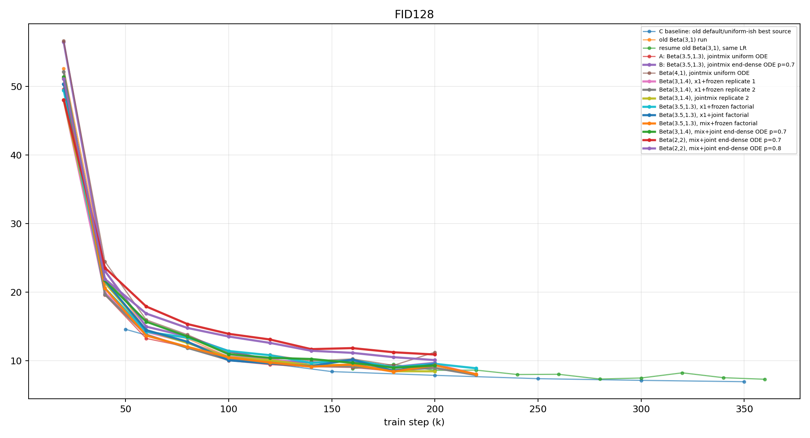
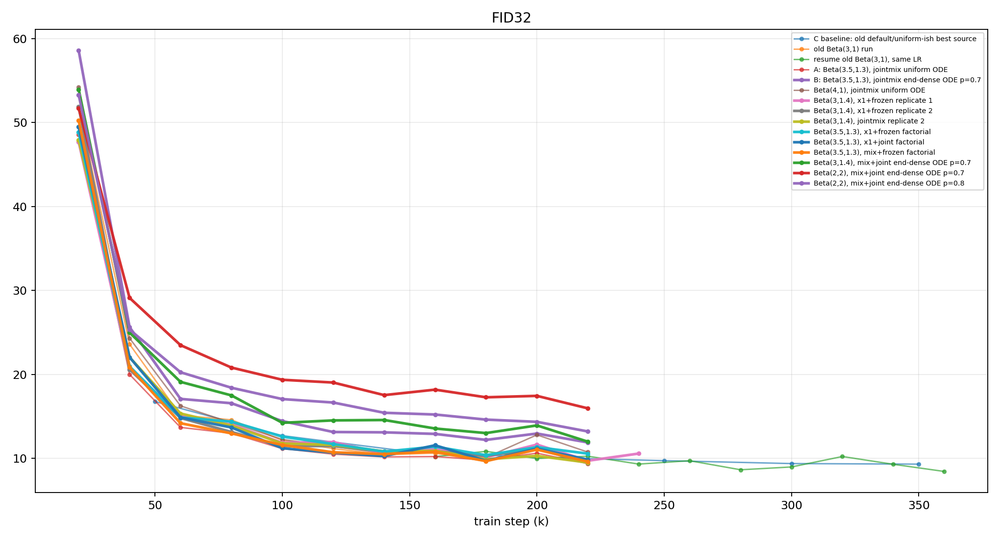
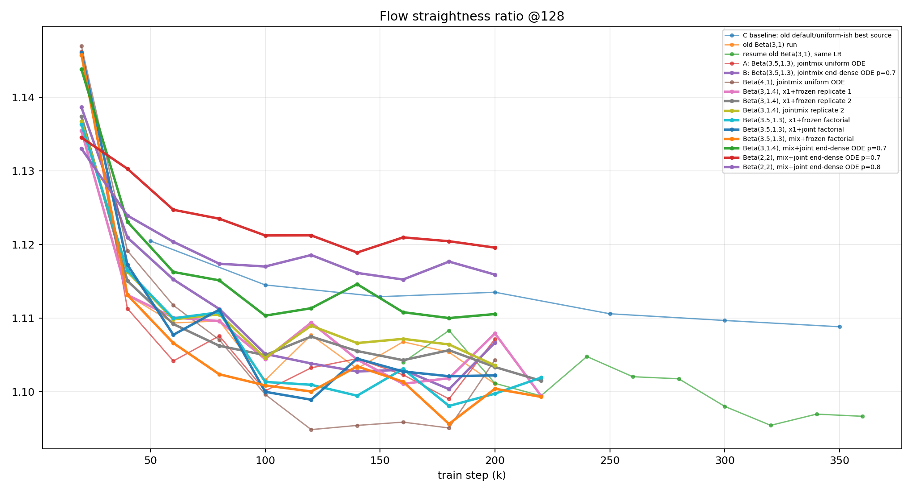
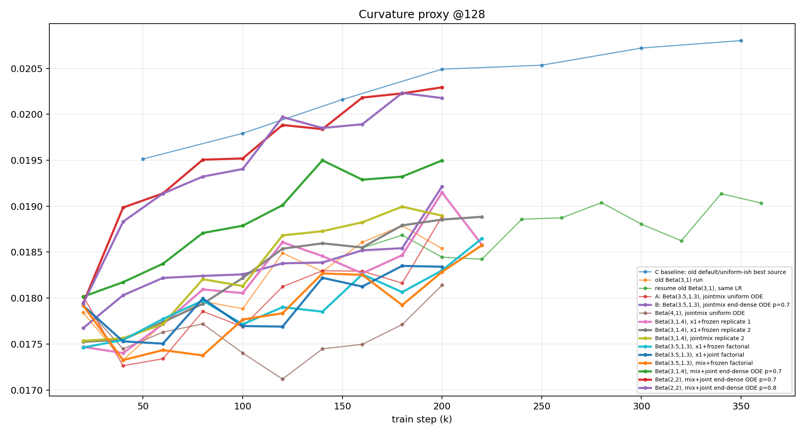

# TIDE Recent Run Analysis 2026-05-30/31

## Download Status

| run | owner/status | download | note |
|---|---|---|---|
| `tide-k16-top2-softv0p75-s128-dir512` |  / historical_downloaded | downloaded | `` |
| `tide-beta31-k16-top2-soft075-dir512-jointmix` |  / historical_downloaded | downloaded | `` |
| `tide-resume150-beta31-k16-top2-soft075-dir512-jointmix` | kieuhongquan / KernelWorkerStatus.CANCEL_ACKNOWLEDGED | downloaded | `kieuhongquan/tide-resume150-beta31-k16-top2-soft075-dir512-jo` |
| `tide-beta35-13-k16-top2-soft075-dir512-jointmix` | codemaivanngu / KernelWorkerStatus.CANCEL_ACKNOWLEDGED | downloaded | `codemaivanngu/tide-beta35-13-k16-top2-soft075-dir512-jointmix` |
| `tide-beta35-13-enddense07-k16-top2-soft075-dir512-jointmix` | huynhtule / KernelWorkerStatus.CANCEL_ACKNOWLEDGED | downloaded | `huynhtule/tide-beta35-13-enddense07-k16-top2-soft075-dir51` |
| `tide-beta41fresh-k16-top2-soft075-dir512-jointmix` | hoanganpham123 / KernelWorkerStatus.CANCEL_ACKNOWLEDGED | downloaded | `hoanganpham123/tide-beta41fresh-k16-top2-soft075-dir512-jointmi` |
| `tide-beta31p4-x1frozen-k16-top2-soft075-dir512` | huynhtule / KernelWorkerStatus.CANCEL_ACKNOWLEDGED | downloaded | `huynhtule/tide-beta31p4-x1frozen-k16-top2-soft075-dir512-h` |
| `tide-beta31p4-x1frozen-k16-top2-soft075-dir512-r2` | victorharvey27 / KernelWorkerStatus.CANCEL_ACKNOWLEDGED | downloaded | `victorharvey27/tide-beta31p4-x1frozen-k16-top2-soft075-dir512-r` |
| `tide-beta31p4-jointmix-k16-top2-soft075-dir512-r2` | iamlonely / KernelWorkerStatus.CANCEL_ACKNOWLEDGED | downloaded | `iamlonely/tide-beta31p4-jointmix-k16-top2-soft075-dir512-r` |
| `beta31p4_jointmix_kiuvithong` | kiuvithong / KernelWorkerStatus.CANCEL_ACKNOWLEDGED | empty_train_metrics | `train_metrics.csv is empty; GMM/router diagnostics exist but no FM curve` |
| `tide-beta35-13-x1frozen-k16-top2-soft075-dir512` | casihoavinh / KernelWorkerStatus.CANCEL_ACKNOWLEDGED | downloaded | `casihoavinh/tide-beta35-13-x1frozen-k16-top2-soft075-dir512` |
| `tide-beta35-13-x1joint-k16-top2-soft075-dir512` | codemaivanngu / KernelWorkerStatus.CANCEL_ACKNOWLEDGED | downloaded | `codemaivanngu/tide-beta35-13-x1joint-k16-top2-soft075-dir512-c` |
| `tide-beta35-13-mixfrozen-k16-top2-soft075-dir512` | hoanganpham123 / KernelWorkerStatus.CANCEL_ACKNOWLEDGED | downloaded | `hoanganpham123/tide-beta35-13-mixfrozen-k16-top2-soft075-dir512` |
| `tide-beta31p4-enddense07-k16-top2-soft075-dir512-jointmix` | nguyncmnhda / KernelWorkerStatus.CANCEL_ACKNOWLEDGED | downloaded | `nguyncmnhda/tide-beta31p4-enddense07-k16-top2-soft075-dir512` |
| `tide-beta22-enddense07-k16-top2-soft075-dir512-jointmix` | manh1904 / KernelWorkerStatus.CANCEL_ACKNOWLEDGED | downloaded | `manh1904/tide-beta22-enddense07-k16-top2-soft075-dir512-j` |
| `tide-beta22-enddense08-k16-top2-soft075-dir512-jointmix` | veilwings / KernelWorkerStatus.CANCEL_ACKNOWLEDGED | downloaded | `veilwings/tide-beta22-enddense08-k16-top2-soft075-dir512-j` |

## Ranking By FID128

| rank | run | note | step train/eval | FID128 best/last | FID32 best/last | valid loss | straight128/curv128 | ODE p/enddense | pred/target var | x0/x1 |
|---:|---|---|---:|---:|---:|---:|---:|---:|---:|---:|
| 1 | `tide-k16-top2-softv0p75-s128-dir512` | C baseline: old default/uniform-ish best source | 365600/350000 | 6.97/6.97 | 9.29/9.29 | 0.474 | 1.109/0.0208 | / | 0.653 | 1.006 |
| 2 | `tide-resume150-beta31-k16-top2-soft075-dir512-jointmix` | resume old Beta(3,1), same LR | 376600/360000 | 7.33/7.33 | 8.42/8.42 | 0.468 | 1.097/0.0190 | / | 0.657 | 1.007 |
| 3 | `tide-beta31p4-x1frozen-k16-top2-soft075-dir512-r2` | Beta(3,1.4), x1+frozen replicate 2 | 240000/240000 | 7.93/7.93 | 9.44/9.44 | 0.457 | 1.102/0.0189 | 1.00/0 | 0.661 | 1.002 |
| 4 | `tide-beta31p4-x1frozen-k16-top2-soft075-dir512` | Beta(3,1.4), x1+frozen replicate 1 | 240000/240000 | 8.05/8.05 | 9.70/10.56 | 0.459 | 1.099/0.0186 | 1.00/0 | 0.657 | 1.003 |
| 5 | `tide-beta35-13-mixfrozen-k16-top2-soft075-dir512` | Beta(3.5,1.3), mix+frozen factorial | 240000/240000 | 8.06/8.06 | 9.59/9.59 | 0.464 | 1.099/0.0186 | 1.00/0 | 0.655 | 1.004 |
| 6 | `tide-beta31-k16-top2-soft075-dir512-jointmix` | old Beta(3,1) run | 220000/220000 | 8.35/9.20 | 9.36/9.36 | 0.477 | 1.101/0.0185 | / | 0.645 | 1.011 |
| 7 | `tide-beta31p4-jointmix-k16-top2-soft075-dir512-r2` | Beta(3,1.4), jointmix replicate 2 | 220000/220000 | 8.48/8.48 | 9.49/9.49 | 0.464 | 1.104/0.0189 | 1.00/0 | 0.654 | 1.008 |
| 8 | `tide-beta35-13-k16-top2-soft075-dir512-jointmix` | A: Beta(3.5,1.3), jointmix uniform ODE | 220000/220000 | 8.51/9.00 | 9.36/9.36 | 0.472 | 1.107/0.0189 | / | 0.648 | 1.013 |
| 9 | `tide-beta35-13-x1joint-k16-top2-soft075-dir512` | Beta(3.5,1.3), x1+joint factorial | 220000/220000 | 8.54/9.52 | 9.69/9.83 | 0.467 | 1.102/0.0183 | 1.00/0 | 0.653 | 1.011 |
| 10 | `tide-beta35-13-x1frozen-k16-top2-soft075-dir512` | Beta(3.5,1.3), x1+frozen factorial | 240000/240000 | 8.92/8.92 | 10.36/10.55 | 0.467 | 1.102/0.0186 | 1.00/0 | 0.653 | 1.000 |
| 11 | `tide-beta31p4-enddense07-k16-top2-soft075-dir512-jointmix` | Beta(3,1.4), mix+joint end-dense ODE p=0.7 | 220000/220000 | 9.01/9.33 | 11.97/11.97 | 0.470 | 1.111/0.0195 | 0.70/1 | 0.656 | 1.021 |
| 12 | `tide-beta35-13-enddense07-k16-top2-soft075-dir512-jointmix` | B: Beta(3.5,1.3), jointmix end-dense ODE p=0.7 | 220000/220000 | 9.12/9.72 | 11.88/11.88 | 0.478 | 1.107/0.0192 | 0.70/1 | 0.651 | 1.023 |
| 13 | `tide-beta41fresh-k16-top2-soft075-dir512-jointmix` | Beta(4,1), jointmix uniform ODE | 220000/220000 | 9.35/11.27 | 10.08/10.73 | 0.482 | 1.104/0.0181 | / | 0.642 | 1.013 |
| 14 | `tide-beta22-enddense08-k16-top2-soft075-dir512-jointmix` | Beta(2,2), mix+joint end-dense ODE p=0.8 | 220000/220000 | 10.12/10.12 | 13.19/13.19 | 0.463 | 1.116/0.0202 | 0.80/1 | 0.654 | 1.012 |
| 15 | `tide-beta22-enddense07-k16-top2-soft075-dir512-jointmix` | Beta(2,2), mix+joint end-dense ODE p=0.7 | 220000/220000 | 10.93/10.93 | 15.94/15.94 | 0.460 | 1.120/0.0203 | 0.70/1 | 0.657 | 1.008 |

## Plots

## New End-Dense Takeaways

- Added `Beta(3,1.4)+mix+joint+end_dense p=0.7`: FID128 best `9.01`, worse than its uniform counterpart `8.48`.
- Added `Beta(2,2)+mix+joint+end_dense p=0.7/p=0.8`: FID128 best `10.93` and `10.12`; both are poor.
- In these data, end-dense is consistently harmful across `Beta(3.5,1.3)`, `Beta(3,1.4)`, and `Beta(2,2)`.
- `Beta(2,2)` does not rescue end-dense; p=0.8 is better than p=0.7 but still far behind uniform/best beta runs.

## Files

- Summary CSV: `reports/tide_recent_analysis_20260530.csv`
- Summary JSON: `reports/tide_recent_analysis_20260530.json`
- End-dense bridge data root: `outputs/kaggle/enddense_bridge_20260531`
